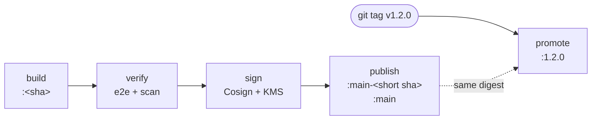

# Continuous integration

[](CI.md) [](../fr/CI.md)

Votely is built and tested by GitLab CI on every merge request and on every commit to `main`.
Pipelines: https://gitlab.com/StateOfFlowHunter/votely/-/pipelines

## Layout

```
.gitlab-ci.yml                  # entry point: workflow, stages, defaults, includes
.gitlab/ci/
├── templates.gitlab-ci.yml     # shared building blocks (Docker build, rules)
├── backend.gitlab-ci.yml       # backend:* jobs
├── frontend.gitlab-ci.yml      # frontend:* jobs
├── e2e.gitlab-ci.yml           # e2e:* jobs
├── security.gitlab-ci.yml      # security:* jobs
├── deploy.gitlab-ci.yml        # deploy:* jobs (Helm charts)
└── infra.gitlab-ci.yml         # infra:* jobs (Terraform)
```

- One file per component: everything that concerns the backend pipeline is in one place, while
  the stages are declared once in `.gitlab-ci.yml`.
- The `.gitlab-ci.yml` suffix lets editors and the GitLab tooling recognise and validate the files.
- Jobs are named `<component>:<action>-<tool>` (`backend:lint-ruff`, `frontend:test-vitest`), so
  the pipeline graph reads at a glance.
- Each file starts with a hidden job (`.backend`, `.frontend`, `.e2e`) holding the image, cache
  and rules shared by the component's jobs, which `extends` it.

## When pipelines run

| Event | Pipeline | Jobs |
|---|---|---|
| Merge request | yes | only components whose files (or their CI file) changed |
| Push to a branch with an open merge request | no (the merge request pipeline covers it) | – |
| Push to `main` | yes | all jobs |
| Release tag `vX.Y.Z` | yes | only `*:promote-image` (see [Releases](#publishing-and-releases)) |
| Other tags | no | – |

Filtering merge request jobs by changed paths keeps pipelines fast and saves CI minutes; `main`
always runs everything, so the default branch is always fully verified.

A new push cancels the running pipeline of the same branch (`interruptible` jobs). Jobs are
retried once on infrastructure failures only, never on a failing test or check.

## Stages

```
.pre      security:secrets-gitleaks
analyze   backend:lint-ruff  frontend:lint-oxlint  frontend:format-prettier  frontend:typecheck-tsc
          e2e:format-prettier  e2e:typecheck-tsc  security:sast-semgrep  security:deps-trivy
          deploy:lint-helm  deploy:validate-kubeconform
          infra:format-terraform  infra:validate-terraform  infra:lint-tflint  infra:plan-terraform
test      backend:test-pytest  frontend:test-vitest
build     backend:build-image  frontend:build-image
verify    e2e:test-playwright  security:scan-image-trivy: [backend, frontend]
publish   backend:sign-image  frontend:sign-image  →  backend:publish-image  frontend:publish-image
          (release tags: *:promote-image)
```

| Stage | Purpose | Job | Tool and scope |
|---|---|---|---|
| `.pre` | Gate: always first | `security:secrets-gitleaks` | gitleaks: secrets in the new commits (merge requests) or the whole history (default branch) |
| `analyze` | Source code, without running it | `backend:lint-ruff` | ruff: lint and security rules (Bandit), import order, formatting |
| | | `frontend:lint-oxlint` | oxlint (warnings fail the job) |
| | | `frontend:format-prettier`, `e2e:format-prettier` | Prettier |
| | | `frontend:typecheck-tsc`, `e2e:typecheck-tsc` | TypeScript compiler, strict mode |
| | | `security:sast-semgrep` | Semgrep: Python, TypeScript, React, OWASP Top 10 and Dockerfile rulesets |
| | | `security:deps-trivy` | Trivy: known vulnerabilities in the production dependencies (`uv.lock`, `package-lock.json`) |
| | | `deploy:lint-helm`, `deploy:validate-kubeconform` | Helm lint (strict), then every rendered manifest validated against the Kubernetes API schemas |
| `test` | Running the code | `backend:test-pytest` | pytest: unit and integration tests against a PostgreSQL 16 service, migrations included; coverage ≥ 90 % |
| | | `frontend:test-vitest` | Vitest: components and pages against a fake API (MSW); coverage ≥ 80 % of lines |
| `build` | Production images | `backend:build-image`, `frontend:build-image` | Docker BuildKit, pushed to the GitLab container registry |
| `verify` | The images just built | `e2e:test-playwright` | Playwright, desktop and mobile, against the full stack running those images |
| | | `security:scan-image-trivy` | Trivy: vulnerabilities and secrets in each image, and its SBOM |
| `publish` | Signed, then tagged | `backend:sign-image`, `frontend:sign-image` | Cosign with an AWS KMS key: signature and signed SBOM attestation (default branch) |
| | | `backend:publish-image`, `frontend:publish-image` | crane: `main` and `main-<short sha>` on the verified and signed images (default branch) |
| | | `backend:promote-image`, `frontend:promote-image` | crane: version tag on the image verified on `main` (release tags only) |

Job names follow `<component>:<action>-<tool>`: what the job does and with which tool, grouped
by component in the graph.

Each test job only waits for the checks of its own component (`needs`), so a slow frontend
check never delays the backend tests.

`backend:test-pytest` runs with `CI=true` (always defined by GitLab): if PostgreSQL were
unreachable, the integration tests would fail instead of being skipped as they are locally.

## Security checks

Checks that only need the source code run first; the scan of the images (once built) comes in
the `verify` stage.

| Job | Finds | Fails when |
|---|---|---|
| `security:secrets-gitleaks` | Passwords, tokens and keys committed to Git | any secret is found |
| `security:sast-semgrep` | Vulnerable code patterns in our code (injection, unsafe headers, weak crypto…) | any finding |
| `backend:lint-ruff` (`S` rules) | Python-specific risky calls (`eval`, `subprocess` with a shell, hardcoded passwords…) | any finding outside `tests/` |
| `security:deps-trivy` | Known CVEs in the production dependencies | a HIGH or CRITICAL vulnerability **with a fix available** |
| `security:scan-image-trivy` | Known CVEs in everything the images contain (base OS packages included), secrets left in a layer | a fixable HIGH or CRITICAL vulnerability, or a secret |

- Only fixable dependency vulnerabilities fail the pipeline: they are the ones we can act on
  (upgrade); the others are listed in the `trivy-deps.json` artifact. Development dependencies
  (Vite, Vitest, Playwright) are not part of the images and are not scanned.
- Every finding is also written as **JUnit**, so it appears as a failed test in the pipeline
  *Tests* tab and in the merge request widget. GitLab's native security widgets require the
  Ultimate tier; full reports (SARIF, JSON) are kept as artifacts.
- The first Semgrep run found that nginx forwarded the client's `Host` header to the API (an
  attacker-controlled value); it is no longer forwarded.

### Image scan and SBOM

`security:scan-image-trivy` runs once per image (`parallel: matrix`), alongside the end-to-end
tests, on the digest exported by the build job: the scanned image is the one that will be
deployed.

- **Why scan the images too**: the lockfiles only list our dependencies. The base image brings
  its own packages (Debian or Alpine, OpenSSL, zlib…), and a file copied by mistake can carry a
  secret. Both only exist in the image.
- **No Docker daemon**: Trivy reads the layers straight from the registry, authenticated with the
  job token.
- **SBOM** (*Software Bill of Materials*): the scan also lists every package of the image, saved
  as a CycloneDX artifact (`sbom-<component>.cdx.json`). When a new CVE is published, the SBOM
  tells which images contain the affected package without rebuilding or rescanning them. It is
  then signed and attached to the image (see [Signed images](#signed-images)).
- **Verified**: an old `nginx:1.20-alpine` image fails the job (30 fixable HIGH/CRITICAL
  vulnerabilities), and so does an image with a GitHub token written in a layer (reported masked).

### Defence in depth for secrets

A pipeline starts **after** the push: by then a leaked secret is already public (and mirrored).
The CI job limits the damage, it cannot prevent the leak. Several layers are therefore combined:

| Layer | When | How |
|---|---|---|
| 1. Prevention | Before the commit | gitleaks pre-commit hook (`uvx pre-commit install`) |
| 2. Push protection | The push is refused | GitHub push protection on the mirror; GitLab secret push protection (Ultimate) |
| 3. Detection | After the push | `security:secrets-gitleaks`, which stops the pipeline: nothing is built or deployed |
| 4. Response | As soon as detected | **Revoke and rotate the secret.** Rewriting Git history is not enough: public repositories are scraped within minutes |

## Container images

Images are pushed to the project's container registry:
`registry.gitlab.com/stateofflowhunter/votely/<component>:<commit SHA>`.

- **Immutable tags**: the full commit SHA identifies exactly what was built. Deployment tags
  (`main`, versions) are only added once the images have passed the `verify` stage (see
  below).
- **Never untested**: each build job `needs` the tests of its component, so a failing test stops
  the image from being published.
- **Both images, or none**: build jobs run when any application path changes (`.rules:app`), so
  the end-to-end tests always run a backend and a frontend from the same commit. Rebuilding an
  unchanged image is fast thanks to the layer cache.
- **Layer cache in the registry** (`:buildcache`, BuildKit `mode=max`): written by the default
  branch only, read by every pipeline.
- **Traceability**: OCI labels record the source repository, the commit and the build date.
- **Digest handed to later jobs**: each build exports `BACKEND_IMAGE` / `FRONTEND_IMAGE`
  (`…@sha256:…`) as a dotenv artifact, so later jobs use exactly the image that was built, not a
  tag that could move.

Builds use Docker-in-Docker with BuildKit (`docker buildx`), the standard setup on GitLab.com
shared runners.

## Publishing and releases

Images are **built once and promoted**: a release never rebuilds anything, it gives a version
number to an image that was already verified on `main`.



| Tag | Added by | Points to |
|---|---|---|
| `<commit sha>` | `*:build-image`, every pipeline | a build, verified or not (merge requests too) |
| `main-<short sha>` | `*:publish-image`, default branch | the image of that commit, **verified** by the whole pipeline |
| `main` | `*:publish-image`, default branch | the latest verified image (staging) |
| `1.2.0` | `*:promote-image`, release tag `v1.2.0` | the same digest as `main-<short sha>` (production) |

- **What runs in production is what was tested**, byte for byte: same digest as the image that
  went through the end-to-end tests, the scans and staging. A rebuild would pull newer base
  images and packages, and produce a different, untested image.
- `main-<short sha>` is only added after `verify`, so its existence proves the image was
  verified. The promotion job looks for it: tagging a commit that is not on `main`, or whose
  pipeline failed, makes the release pipeline fail with an explicit message.
- Tags are added in the registry with [crane](https://github.com/google/go-containerregistry/tree/main/cmd/crane):
  no Docker daemon, nothing pulled, a few seconds per image.
- Release pipelines run nothing else: the commit was already checked on `main`.

### Signed images

On `main`, every image is signed before it gets a deployment tag, so an unsigned image is never
promoted.

| Step | What `*:sign-image` does |
|---|---|
| Sign | `cosign sign` on the digest, with the key `awskms:///alias/votely-cosign`: the private key never leaves AWS KMS, the job only asks KMS to sign |
| Attest | `cosign attest --type cyclonedx`: the SBOM from the image scan, signed and attached to the image |
| Check | `cosign verify` and `cosign verify-attestation` with the public key committed in the repository ([`cosign.pub`](../../cosign.pub)), exactly as anyone else would |

- The job reaches KMS with temporary AWS credentials obtained through OpenID Connect; only
  pipelines of the default branch may assume the signing role (see [INFRA.md](INFRA.md#ci-access-openid-connect)).
- As for a private company registry, nothing is sent to the public Sigstore transparency log
  (Rekor): signatures and attestations are stored in the project registry, next to the image
  (`sha256-…` tags, kept by the cleanup policy).
- Anyone can check an image:

  ```bash
  cosign verify --key cosign.pub --insecure-ignore-tlog \
    registry.gitlab.com/stateofflowhunter/votely/backend:main
  cosign verify-attestation --key cosign.pub --insecure-ignore-tlog --type cyclonedx \
    registry.gitlab.com/stateofflowhunter/votely/backend:main
  ```

  `--insecure-ignore-tlog` only tells Cosign not to look for the signature in the public log,
  where it was deliberately not published. Images released before signing was introduced
  (`0.1.0`) have no signature.

To release, once the `main` pipeline of the commit has passed:

```bash
git tag -a v1.2.0 -m "v1.2.0"
git push origin v1.2.0
```

The registry cleanup policy keeps version tags, `main`, the build cache and the signatures
(`sha256-…`); older commit images are removed after 14 days, so a commit should be released
within that time.

## End-to-end tests

`e2e:test-playwright` runs the same disposable stack as on a laptop (`compose.yaml` + `compose.e2e.yaml`),
inside Docker-in-Docker, with the **exact images built by the pipeline**: the build jobs' digests
(`BACKEND_IMAGE`, `FRONTEND_IMAGE`) are passed to Compose through `VOTELY_BACKEND_IMAGE` and
`VOTELY_FRONTEND_IMAGE`. What is tested is byte for byte what will be deployed.

- Database credentials are throwaway CI values; the JWT signing key is random for every run.
- Playwright runs in the official image (`mcr.microsoft.com/playwright`), attached to the stack
  network, and reaches nginx at `http://frontend:8080`.
- The dind daemon does not share the job's filesystem, so the tests are copied in and the
  reports copied out with `docker cp`.
- Artifacts, kept one week even on failure: the HTML report, traces/videos/screenshots of failed
  tests, and the logs of every container of the stack.

## Reports

| Report | Where it shows up |
|---|---|
| JUnit (backend, frontend, e2e and security jobs) | *Tests* tab of the pipeline, and the merge request widget (new and fixed failures) |
| Coverage percentage | Merge request widget and job list, extracted from the job log |
| Cobertura (`coverage.xml`) | Covered and uncovered lines highlighted in the merge request diff |

Reports are uploaded even when tests fail (`when: always`) and kept one week.

## Caching

Dependencies are cached per component, keyed on the lockfile (`uv.lock`, `package-lock.json`):
the cache is reused until dependencies change. Lockfiles are always respected (`UV_FROZEN`,
`npm ci`), so CI never installs something different from what was reviewed.

## Images

| Component | CI image |
|---|---|
| Backend | `ghcr.io/astral-sh/uv:0.12-python3.12-trixie-slim` (same Python and Debian as the production image) |
| Frontend, e2e | `node:24-alpine` |
