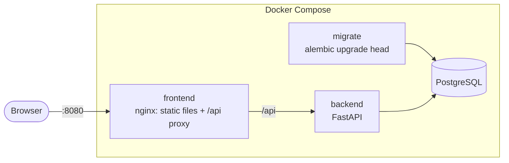

# Containers

[](CONTAINERS.md) [](../fr/CONTAINERS.md)

Votely ships as two images, built from multi-stage Dockerfiles, and runs locally as a full stack
with Docker Compose.

| Image | Base | Compressed size | Runs as |
|---|---|---|---|
| `votely-backend` | `python:3.12-slim` | ~76 MB | uid `10001` |
| `votely-frontend` | `nginxinc/nginx-unprivileged:1.30-alpine` | ~26 MB | uid `101` |

## Run the full stack

```bash
cp .env.example .env     # set a database password and a JWT secret (openssl rand -hex 32)
docker compose up --build
```

Open http://localhost:8080. Only the frontend is published, on `127.0.0.1`.



| Service | Role | Starts when |
|---|---|---|
| `db` | PostgreSQL 16, data in the `db-data` volume | – |
| `migrate` | One-shot job: `alembic upgrade head`, then exits | `db` is healthy |
| `backend` | API, not published on the host | `migrate` completed successfully |
| `frontend` | nginx on port 8080 | `backend` is healthy |

Running migrations as a separate job, before the API starts, means several API replicas never
race to migrate the schema. The same pattern becomes a Kubernetes Job later.

`docker compose up -d db` still starts the database alone, for local development without
containers for the application (see the [README](../../README.md)).

## Backend image

- **Build stage**: `uv sync --frozen --no-dev` installs exactly the locked dependencies into a
  virtualenv. Dependencies are installed before the code is copied, so this layer stays cached
  until `uv.lock` changes.
- **Runtime stage**: only the virtualenv, `app/` and the migrations are copied. No uv, no
  compiler, no tests.
- Debian security updates are applied on top of the base image (`apt-get upgrade`), so fixes
  published after the base image was built are not waiting for the next upstream rebuild.
- Runtime dependencies are kept lean: `fastapi` + `uvicorn[standard]` instead of
  `fastapi[standard]`, which also brings CLI and cloud tooling (–40 % virtualenv size).
- `HEALTHCHECK` calls `/healthz` with Python (slim images have no curl).
- Uvicorn trusts `X-Forwarded-*` headers, as the API always runs behind a reverse proxy.

## Frontend image

- **Build stage**: `npm ci` then `npm run build` on Node.js 24.
- **Runtime stage**: the static files served by nginx, as a non-root user on port 8080.
- The nginx configuration (`frontend/nginx/`) is a template: `VOTELY_API_UPSTREAM` is injected
  at startup, so **the same image** works in any environment.

| Path | Behaviour |
|---|---|
| `/api/` | Reverse proxy to the backend (same origin for the browser). The host name is re-resolved every 10 s, so a restarted backend with a new IP is found again; an unreachable backend fails fast with `502` (5 s connect timeout) |
| `/assets/` | Fingerprinted files, cached one year (`immutable`), gzip |
| `/healthz` | Container liveness |
| anything else | `index.html` (client-side routes), `no-cache` so deployments are picked up |

Security headers sent on every response:

| Header | Effect |
|---|---|
| `Content-Security-Policy` | Only resources from the same origin; no inline scripts, no framing |
| `X-Content-Type-Options: nosniff` | No MIME type guessing |
| `Referrer-Policy: strict-origin-when-cross-origin` | No full URLs leaked to other sites |
| `Permissions-Policy` | Camera, microphone and geolocation disabled |

`server_tokens off` hides the nginx version.

## Hardening

Applied to the application containers in `compose.yaml`:

| Measure | Effect |
|---|---|
| Non-root users | A compromised process has no root privileges in the container |
| `read_only: true` | Nothing can be written outside explicit `tmpfs` mounts |
| `cap_drop: [ALL]` | No Linux capabilities at all |
| `no-new-privileges` | No privilege escalation through setuid binaries |
| Ports bound to `127.0.0.1` | Nothing is reachable from the local network |
| Minimal build contexts (`.dockerignore`) | `.env`, caches and tests never reach the images |

## Checks

```bash
# Vulnerabilities with a fix available
docker run --rm -v /var/run/docker.sock:/var/run/docker.sock aquasec/trivy \
  image --severity HIGH,CRITICAL --ignore-unfixed votely-backend:local

# Secrets accidentally embedded in an image
docker run --rm -v /var/run/docker.sock:/var/run/docker.sock aquasec/trivy \
  image --scanners secret votely-frontend:local
```

Both images currently report no fixable HIGH/CRITICAL vulnerability and no secret. In CI,
`security:scan-image-trivy` runs both checks on every image built (see
[CI.md](CI.md#image-scan-and-sbom)).

## Configuration

| Variable | Used by | Default |
|---|---|---|
| `POSTGRES_USER`, `POSTGRES_PASSWORD`, `POSTGRES_DB` | `db`, backend URL | – (required) |
| `VOTELY_JWT_SECRET` | backend | – (required) |
| `VOTELY_COOKIE_SECURE` | backend | `true` (`false` in `.env` for plain HTTP on localhost) |
| `VOTELY_LOG_LEVEL` | backend | `INFO` |
| `VOTELY_HTTP_PORT` | frontend published port | `8080` |
| `VOTELY_API_UPSTREAM` | frontend nginx | `http://backend:8000` |
| `VOTELY_BACKEND_IMAGE`, `VOTELY_FRONTEND_IMAGE` | Compose | `votely-backend:local`, `votely-frontend:local` (CI runs the registry images instead) |
