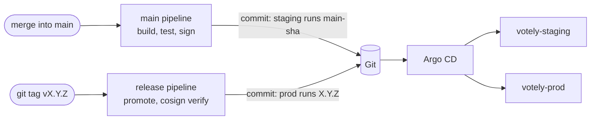

# GitOps (Argo CD)

[](GITOPS.md) [](../fr/GITOPS.md)

The cluster runs what the default branch describes. [Argo CD](https://argo-cd.readthedocs.io/),
running in the cluster, compares Git with the cluster continuously and applies the differences.
The pipeline never touches the cluster: to deploy, it commits a version to Git.



## Layout

```
deploy/
├── argocd/
│   ├── root.yaml                  # the root application, applied once
│   └── apps/                      # every application of the cluster
├── environments/
│   ├── staging/                   # values.yaml (version, hostname) + sealed-secrets.yaml
│   └── prod/
├── platform/
│   ├── argocd/values.yaml         # Argo CD settings
│   ├── cert-manager/              # Let's Encrypt issuers
│   └── sealed-secrets/            # public sealing certificate
└── helm/                          # postgres and votely charts
```

**App of apps:** the root application watches `deploy/argocd/apps/` on `main`. Adding a file
there deploys a new application; removing it removes the application. Sync waves order the
platform first.

| Application | Contents | Wave |
|---|---|---|
| `cert-manager` | cert-manager chart (HTTPS certificates) | -2 |
| `sealed-secrets` | Sealed Secrets controller | -2 |
| `cluster-issuers` | Let's Encrypt staging and production issuers | -1 |
| `staging-database`, `prod-database` | PostgreSQL and the environment's sealed credentials | 0 |
| `staging-votely`, `prod-votely` | Votely chart with the environment's values | 0 |

Every application syncs automatically, prunes what Git no longer describes and **self-heals**:
a change made by hand in the cluster is reverted to what Git says.

## Environments

| | Staging | Production |
|---|---|---|
| Namespace | `votely-staging` | `votely-prod` |
| URL | https://staging.votely.52.16.15.223.sslip.io | https://votely.52.16.15.223.sslip.io |
| Version | every merge into `main` | release tags only |
| Replicas | 1 | 2 |

Each environment has its own database, its own credentials and its own certificate.

## Deploying

| To | How | What happens |
|---|---|---|
| **Staging** | Merge a merge request | `staging:update-git` commits `main-<short sha>` to `deploy/environments/staging/values.yaml` once the images are signed |
| **Production** | `git tag -a vX.Y.Z <merge commit>` then push the tag | `prod:verify-cosign` checks the signatures, `prod:update-git` commits `X.Y.Z` to `deploy/environments/prod/values.yaml` |

Tag the merge commit that runs in staging: the CI's own `chore(deploy)` commits run no
pipeline and have no images.

Every deployment is a commit by **Votely CI**, `chore(deploy): <env> runs <version> [skip ci]`:
the history tells what ran where and when. `[skip ci]` stops a version change from starting
another pipeline. The CI writes with `GITOPS_TOKEN`, a project access token limited to
`write_repository`, stored as a masked, hidden and protected variable: only the default branch
and protected release tags (`v*`) receive it, never a merge request.

Argo CD checks Git every three minutes: a deployment starts within minutes of the commit.

## Rolling back

```bash
git revert <the chore(deploy) commit>
git push origin main
```

The revert keeps `[skip ci]` and Argo CD deploys the previous version. Database migrations are
not reverted: a migration must stay compatible with the previous version of the application
(add before you remove), so that rolling back the code is always safe.

## Secrets

Credentials are generated and sealed by [`deploy/aws/seal-secrets.sh`](../../deploy/aws/seal-secrets.sh)
with the controller's public certificate; only the controller in the cluster can decrypt them.
A sealed secret is bound to its namespace and name.

- **Rotating** a credential: delete `deploy/environments/<env>/sealed-secrets.yaml`, run the
  script again and merge. Pods read their environment at start: restart them
  (`kubectl rollout restart deployment -n votely-<env>`). PostgreSQL only uses its password when
  its data directory is first created: a new database password must also be set in the database
  (`ALTER USER`).
- **The controller's private key** lives in the cluster, on the persistent data disk. A copy
  kept outside Git allows a new cluster to read the same sealed secrets:

  ```bash
  kubectl -n kube-system get secret -l sealedsecrets.bitnami.com/sealed-secrets-key -o yaml \
    > sealed-secrets-key.yaml   # store it offline, never in Git
  ```

  Without it, a new cluster gets a new key: fetch the new certificate and seal the credentials
  again.

## Access to Argo CD

The web UI is not exposed on the internet. Through the Systems Manager tunnel:

```bash
deploy/aws/tunnel.sh        # terminal 1
deploy/aws/argocd-ui.sh     # terminal 2: prints the initial admin password, opens http://localhost:8080
```

## A new cluster

1. `terraform apply` in `infra/terraform/server` (see [INFRA.md](INFRA.md)).
2. `deploy/aws/fetch-kubeconfig.sh`, then `deploy/aws/tunnel.sh`.
3. `deploy/aws/install-argocd.sh`: Argo CD, then the root application. Everything else comes
   from Git.

With the persistent data disk, a replaced server keeps the whole cluster, Argo CD included: none
of these steps is needed again.
