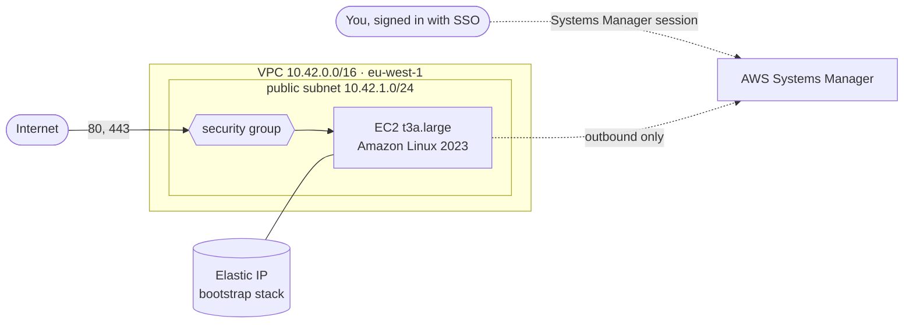

# Infrastructure (AWS)

[](INFRA.md) [](../fr/INFRA.md)

Votely runs on AWS, in **eu-west-1 (Ireland)**. Everything is described with Terraform in
`infra/terraform/`; nothing is created or changed by hand in the console, which is only used to
look.

```
infra/terraform/
├── .tflint.hcl     # lint rules shared by every stack (Terraform + AWS rulesets)
├── bootstrap/      # kept: state bucket, budget alert, permanent public IP
└── server/         # created and destroyed at will: network, firewall, server
```



Each folder is a separate **stack**, with its own state and lifecycle: the bootstrap is created
once and kept, the server is created and destroyed at will.

## Access to AWS

| Who | How | Long-lived secret |
|---|---|---|
| A person | IAM Identity Center: access portal with password + MFA, temporary credentials for the CLI | none |
| The root user | Only for the few account-level tasks that require it; protected by MFA | – |

The CLI uses an SSO profile (`~/.aws/config`, outside the repository):

```ini
[sso-session votely]
sso_start_url = https://<portal-id>.awsapps.com/start
sso_region = eu-west-1
sso_registration_scopes = sso:account:access

[profile votely]
sso_session = votely
sso_account_id = <account id>
sso_role_name = AdministratorAccess
region = eu-west-1
```

```bash
aws sso login --profile votely      # opens the browser: password + MFA, valid 8 hours
export AWS_PROFILE=votely
aws sts get-caller-identity         # who am I? (read-only)
```

No access key is ever created: credentials expire on their own, and there is nothing on disk
that could leak. The account ID is not written in the repository either.

## Bootstrap: Terraform state and budget

Terraform keeps a record of what it manages, the **state**, and compares it with the code to
know what to create, change or delete. The state contains resource details and sometimes
secrets: it never goes to Git, it is stored in a dedicated S3 bucket.

| Setting | Why |
|---|---|
| Versioning | Every change keeps the previous version: a bad apply can be rolled back |
| Encryption (SSE-S3) | Data encrypted at rest |
| Public access blocked, ownership enforced | The bucket can only be reached through IAM |
| HTTPS only (bucket policy) | No unencrypted request accepted |
| Old versions expire after 90 days | History without unbounded growth |
| `prevent_destroy` | Terraform refuses to delete the bucket |
| `use_lockfile` | Native S3 lock: two `apply` can never run at the same time (no DynamoDB table needed) |

The bucket name has a random suffix (`votely-tfstate-08da0d86`): bucket names are global, and
the account ID is kept out of the repository.

The **budget alert** (`votely-monthly`, 10 USD per month) sends an email at 80 % and 100 % of
actual costs, and as soon as AWS forecasts the month will exceed the limit. The address comes
from `terraform.tfvars`, which is ignored by Git (`terraform.tfvars.example` shows the format).

### First run: the state moves into its own bucket

The bootstrap stores its state in the bucket it creates, so the bucket must exist first:

```bash
cd infra/terraform/bootstrap
cp terraform.tfvars.example terraform.tfvars   # then set budget_email

# 1. Create the bucket with a local state (backend_override.tf is ignored by Git)
printf 'terraform {\n  backend "local" {}\n}\n' > backend_override.tf
terraform init
terraform plan -out=bootstrap.tfplan
terraform apply bootstrap.tfplan

# 2. Move the state into the bucket
rm backend_override.tf
terraform init -migrate-state                  # answer "yes"
rm terraform.tfstate bootstrap.tfplan          # the local copies are no longer used
terraform plan                                 # "No changes": code, state and AWS match
```

`terraform plan -out` saves the reviewed plan, and `terraform apply <file>` applies exactly that
plan: if anything changed in between, Terraform refuses the outdated plan instead of doing
something else.

## Server

The `server` stack holds everything that only costs money while it runs. It is created at the
start of a work session and destroyed at the end; the permanent IP address stays in the
bootstrap stack, so the public address (and later the hostname and its HTTPS certificate) never
change.

| Resource | Settings |
|---|---|
| VPC and public subnet | `10.42.0.0/16`, one subnet, an internet gateway. **No NAT gateway**: it would cost more than the server, and the server has its own public address |
| Default security group | Emptied, so nothing can use it by accident |
| Security group | Inbound **80 and 443 only**; outbound open (images, packages, Let's Encrypt, Systems Manager) |
| IAM role | `AmazonSSMManagedInstanceCore` only: the server can register with Systems Manager, nothing else |
| EC2 instance | `t3a.large` (2 vCPU, 8 GiB), latest Amazon Linux 2023, 30 GiB encrypted gp3 disk |
| Instance metadata | IMDSv2 required, one network hop: containers cannot read the instance credentials |
| Elastic IP | Created by the bootstrap stack (`prevent_destroy`), associated by the server stack, found by its `Name` tag |

**No SSH.** Port 22 is closed and no key pair exists. A shell is opened through AWS Systems
Manager, with the same SSO sign-in as the console; every session is recorded in the Session
Manager history. The server connects out to Systems Manager, so no inbound port is needed.

```bash
cd infra/terraform/server
terraform init
terraform plan -out=server.tfplan
terraform apply server.tfplan       # ~2 minutes, prints instance_id, public_ip and shell

aws ssm start-session --target <instance_id>   # needs the Session Manager plugin
nc -zv -w 5 <public_ip> 22                     # times out: SSH is blocked

terraform destroy                   # end of the session: the server stops costing money
```

The Session Manager plugin is a single binary published by AWS; on Linux it can be extracted
from the official `.deb` (`session-manager-plugin.deb`) into `~/.local/bin`.

A newer Amazon Linux image is picked up each time the server is recreated; a running server is
never replaced because a new image was published (`ignore_changes = [ami]`).

## Checks

```bash
cd infra/terraform
terraform fmt -recursive -check
terraform -chdir=bootstrap validate
terraform -chdir=server validate
tflint --init --config="$PWD/.tflint.hcl"
tflint --chdir=bootstrap --config="$PWD/.tflint.hcl"
tflint --chdir=server --config="$PWD/.tflint.hcl"
```

Provider versions are locked in `.terraform.lock.hcl` for Linux and macOS, so every machine and
the CI use the same provider builds.

## Costs

| Resource | Cost |
|---|---|
| State bucket (a few KB) | a few cents per year |
| Budget alert | free (the first two budgets of an account are free) |
| Elastic IP, kept between sessions | ~0.005 USD per hour, ~3.60 USD per month |
| Server (`t3a.large` + 30 GiB disk) while it runs | ~0.09 USD per hour, ~0.70 USD for an 8-hour session |

The server only runs during work sessions: `terraform destroy` in `server/` stops its cost, and
the budget alert reports any oversight.
