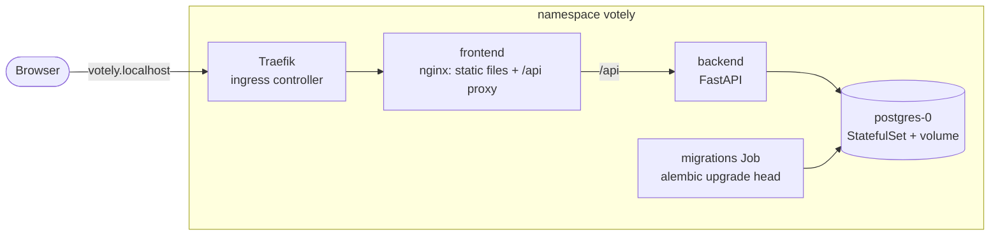

# Kubernetes

[](KUBERNETES.md) [](../fr/KUBERNETES.md)

Votely is packaged for Kubernetes as two Helm charts, in `deploy/helm/`. The same charts run on
a local cluster ([kind](https://kind.sigs.k8s.io/)) and on the k3s server, only their values
change.



## Vocabulary

| Object | Role in Votely |
|---|---|
| Pod | One running container (an API instance, an nginx instance…) |
| Deployment | Keeps the requested number of identical pods running, replaces them one by one on upgrade (backend, frontend) |
| StatefulSet | Same, for a pod that owns data: stable name and its own volume (PostgreSQL) |
| Service | Stable internal address in front of pods (`votely-backend:8000`) |
| Ingress | HTTP routing from outside the cluster: `votely.localhost` → frontend |
| Job | A task that runs to completion (database migrations) |
| Secret | Credentials, injected into pods as environment variables |
| Helm chart / release | A package of templated manifests / one installation of it, with its values |

## Run it locally

Prerequisites: Docker and [mise](https://mise.jdx.dev/) (`mise install` pins kind, kubectl and
Helm).

```bash
deploy/kind/up.sh                    # cluster + Traefik + PostgreSQL + Votely, then http://votely.localhost
VOTELY_TAG=0.1.0 deploy/kind/up.sh   # a released version instead of the latest `main` build
deploy/kind/down.sh                  # delete the cluster and its data
```

`up.sh` is idempotent: run it again to upgrade. It deploys the images published by the CI
(`main` by default), so what runs locally is what passed the pipeline.

The end-to-end suite runs against the cluster like against any other environment:

```bash
cd e2e && E2E_BASE_URL=http://votely.localhost npm test
```

Useful commands:

```bash
kubectl -n votely get pods                     # what is running
kubectl -n votely logs deploy/votely-backend   # API logs
helm -n votely history votely                  # releases and their revisions
helm -n votely rollback votely 1               # back to revision 1
```

## On the AWS server

The same charts run on the k3s server ([INFRA.md](INFRA.md)), at
**https://votely.52.16.15.223.sslip.io**: [sslip.io](https://sslip.io) resolves any name ending
with an IP address to that address, so no domain needs to be bought.

The Kubernetes API is never exposed on the internet: `kubectl` goes through a Systems Manager
tunnel, with the same SSO sign-in as the AWS console.

```
your PC: kubectl ──► localhost:6443 ══ SSM tunnel (encrypted, through AWS) ══► server: k3s API :6443
```

```bash
export AWS_PROFILE=votely
deploy/aws/fetch-kubeconfig.sh      # once: admin kubeconfig to ~/.kube/votely-aws.yaml (never in Git)
deploy/aws/tunnel.sh                # keep it running in a terminal

export KUBECONFIG=~/.kube/votely-aws.yaml
kubectl get nodes                   # votely   Ready
deploy/aws/install.sh               # cert-manager, Secrets, PostgreSQL, Votely (idempotent)
```

| Piece | Role |
|---|---|
| **cert-manager** | Obtains the certificate from Let's Encrypt and renews it 30 days before it expires |
| `letsencrypt-staging`, `letsencrypt-prod` ([`cluster-issuers.yaml`](../../deploy/platform/cert-manager/cluster-issuers.yaml)) | Staging to test without rate limits (untrusted certificate), production for the real one. The HTTP-01 challenge is answered on port 80 through Traefik |
| `values-aws.yaml` | Public hostname, `ingress.clusterIssuer: letsencrypt-prod`, secure session cookie |
| Ingress | Asks cert-manager for the certificate (`cert-manager.io/cluster-issuer`), serves HTTPS, and redirects HTTP with a Traefik `Middleware` (`308`) |

`install.sh` is temporary: Argo CD takes over the deployment with GitOps (step 10). Only the
platform tests (health, security headers, routes) run against this environment, as they create
no data: [TESTS.md](TESTS.md).

## Two charts

| Chart | Contents |
|---|---|
| `postgres` | StatefulSet, headless Service, volume (PersistentVolumeClaim) |
| `votely` | backend and frontend (Deployment + Service each), Ingress, migrations Job |

The database has a different lifecycle from the application: the application is upgraded,
rolled back or reinstalled many times, the data must survive all of it. With separate charts,
nothing done to the `votely` release can delete the database or its volume.

## Database migrations

The migrations Job runs `alembic upgrade head` as a Helm **pre-install / pre-upgrade hook**:
Helm waits for it to succeed before it creates or updates the API pods, so new code never runs
on an old schema. If it fails, the release stops there and the running version keeps serving.

- It is the Kubernetes version of the `migrate` service of Docker Compose: one migration run per
  release, never one per API replica.
- ArgoCD runs these Helm hooks as *PreSync* hooks: the behaviour stays the same with GitOps.
- The Job is deleted once it succeeds; a failed Job is kept for its logs, until the next release.
- Retries (`backoffLimit`) cover a database that is still starting.

## Configuration and secrets

| Value | Default | Purpose |
|---|---|---|
| `image.tag` | `main` | Image version: `main` or a release (`0.1.0`) |
| `host` | `votely.localhost` | Hostname routed by the ingress |
| `ingress.clusterIssuer` | empty | cert-manager ClusterIssuer: HTTPS and HTTP redirection when set |
| `cookieSecure` | `true` | Session cookie over HTTPS only (`false` on the local cluster) |
| `backend.replicas`, `frontend.replicas` | `2` | Pods per component (`1` locally) |
| `database.existingSecret` | `votely-db` | Secret with `username`, `password`, `database` |
| `jwt.existingSecret` | `votely-jwt` | Secret with `jwt-secret` |

`values-kind.yaml` holds the local cluster settings, `values-aws.yaml` those of the AWS server.

- **No secret in the charts or in Git.** The charts only reference Secrets by name. Locally,
  `up.sh` generates random credentials directly in the cluster; on the server, Sealed Secrets
  provides the same Secrets from encrypted files.
- The database URL is assembled by Kubernetes from the Secret keys (`$(DB_PASSWORD)`
  references), so the password never appears in a manifest.

## Security settings

Every pod runs with the settings of the *restricted* Pod Security Standard:

| Setting | Effect |
|---|---|
| `runAsNonRoot` (uid 10001 backend, 101 nginx, 70 postgres) | Refused by Kubernetes if the image would run as root |
| `readOnlyRootFilesystem` | Nothing can be written except to explicit `emptyDir` volumes (`/tmp`, nginx config) |
| `capabilities: drop [ALL]`, `allowPrivilegeEscalation: false` | No Linux capability, no setuid escalation |
| `seccompProfile: RuntimeDefault` | Dangerous system calls blocked |
| `automountServiceAccountToken: false` | Pods get no Kubernetes API credentials: they never need them |

## Health and resources

- **Liveness** (`/healthz`) never touches the database: a database outage must not make
  Kubernetes restart healthy API pods.
- **Readiness** (`/readyz`) checks the database: a pod that cannot serve gets no traffic.
- Every container has CPU and memory requests (scheduling) and a memory limit (a leak cannot
  take the node down).

## Found while deploying

- **Memory limit too low.** Running the end-to-end suite against the cluster got the API pod
  `OOMKilled` at 256 MiB: Argon2 password hashing uses about 64 MiB per login or sign-up in
  progress, and the tests run in parallel. The backend limit is now 512 MiB.
- **Short service names in nginx.** nginx resolves the backend name itself and ignores the
  cluster search domains, so the proxy uses the fully qualified name
  (`votely-backend.<namespace>.svc.cluster.local`).

## Continuous integration

On every merge request that touches `deploy/` (see [CI.md](CI.md)):

- `deploy:lint-helm`: `helm lint --strict` on both charts, then renders every chart with each
  values file (and the cert-manager issuers);
- `deploy:validate-kubeconform`: validates every rendered manifest against the Kubernetes API
  schemas of the cluster version, and custom resources (cert-manager, Traefik) against the
  community CRD catalog. A misspelled field (`runAsNonRot`) fails the pipeline instead
  of the deployment.
