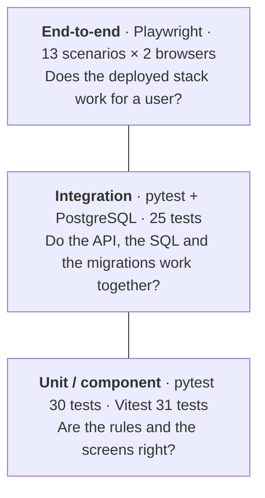

# Tests

[](TESTS.md) [](../fr/TESTS.md)

Votely is tested at three levels. Each level answers a different question, and most tests live
at the fastest level that can answer it.



| Level | Tool | Runs against | Duration | Details |
|---|---|---|---|---|
| Backend unit | pytest | in-memory fakes, fixed clock | < 1 s | [BACK.md](BACK.md#tests) |
| Backend integration | pytest | real PostgreSQL, real migrations | ~5 s | [BACK.md](BACK.md#tests) |
| Frontend | Vitest, Testing Library, MSW | the whole app in jsdom, fake HTTP API | ~2 s | [FRONT.md](FRONT.md#tests) |
| End-to-end | Playwright | the full Docker Compose stack in Chromium | ~10 s | below |

## End-to-end tests

The `e2e/` project drives a real browser against the full Docker Compose stack: nginx, the API,
the migrations and PostgreSQL, exactly as they are shipped.

Tests run on a **disposable stack** (`compose.e2e.yaml` layered on `compose.yaml`): its own
Compose project (`votely-e2e`), its own port (8081) and a database in memory. Development data
is never touched, the development stack can keep running on 8080, and `stack:down` removes
everything.

### Run them

```bash
cd e2e
npm ci
npx playwright install chromium  # once: downloads the browser used by the tests

npm run stack:up                 # disposable stack on http://localhost:8081
npm test                         # headless, desktop + mobile
npm run stack:down               # remove containers and data
```

`E2E_BASE_URL` points the tests to another environment (e.g. staging).

In CI, the `e2e:test` job runs the same suite against the images built by the pipeline (see
[CI.md](CI.md#end-to-end-tests)).

### Watch them

| Command | What you get |
|---|---|
| `npm run test:ui` | Playwright UI: pick tests, watch them run, step through a timeline with DOM snapshots, network and console for each action |
| `npm run test:headed` | A visible Chromium window, one test at a time, 1.5 s between actions. Slower or faster: `SLOW_MO=3000 npm run test:headed` (milliseconds) |
| `npm run test:debug` | Step by step: the Playwright Inspector pauses before each action and highlights the targeted element; *Step over* runs the next one |
| `npm run report` | HTML report of the last run, with screenshots, videos and traces of failed tests |
| `npx playwright show-trace <trace.zip>` | Replay a failed test step by step |

Add `-g "<part of the test name>"` to any of them to run a single test, e.g.
`npm run test:headed -- -g "creates a poll"`.

Traces, videos and screenshots are kept only for failed tests, so the report stays small.

### Scenarios

Every scenario runs twice: **desktop** Chrome and **mobile** (Pixel 7 emulation).

| File | Scenario |
|---|---|
| `auth.spec.ts` | Sign up (session cookie is `HttpOnly` + `SameSite=Lax`), log in through the form, wrong credentials, log out |
| `polls.spec.ts` | Create a poll, vote and see the results · a second vote is impossible in the UI and refused by the API (`409`) · results update live when another user votes · anonymous visitors can read but must log in to vote · login redirects back to poll creation |
| `platform.spec.ts` | Health endpoints · security headers (CSP, `nosniff`, hidden nginx version) · direct access to client-side routes · no console errors |

### Writing rules

- **Independent tests**: each test creates its own users and polls with unique names, so tests
  run in parallel, in any order, against any database.
- **Set up through the API, assert through the UI**: when logging in is not what a test is
  about, it registers and logs in with `page.request` (same cookies as the page), which is fast
  and stable; the screens under test are always used like a user would.
- **Accessible selectors**: elements are found by role and label (`getByRole('button', { name:
  'Vote' })`), never by CSS class. A test that cannot find an element is often an accessibility
  bug.
- **Web-first assertions**: `expect(locator).toBeVisible()` waits for the condition; there is no
  fixed `sleep` anywhere.
- **Several users**: a second browser context gives an independent session, used to test live
  results and permissions.
- **Readable test data**: polls come from a small set of light-hearted French questions
  (`SAMPLE_POLLS` in `tests/fixtures.ts`), so test runs also make good demos and screenshots.

### Reliability

- The suite was run 5 times in a row (130 runs) without a single failure.
- In CI, a failed test is retried once; a test that passes on retry is reported as *flaky*.
- `forbidOnly` fails the CI run if a `test.only` is committed by mistake.

### Bugs found

Stopping the backend during an e2e run showed that nginx waited 30 seconds before failing, and
resolved the backend address only once, at startup. The proxy now re-resolves the address every
10 seconds and fails within 5 seconds with a `502` (see [CONTAINERS.md](CONTAINERS.md)).

## All tests at once

```bash
docker compose up -d db       # PostgreSQL for the backend integration tests
(cd backend && uv run pytest)
(cd frontend && npm test)
(cd e2e && npm run stack:up && npm test; npm run stack:down)
```
