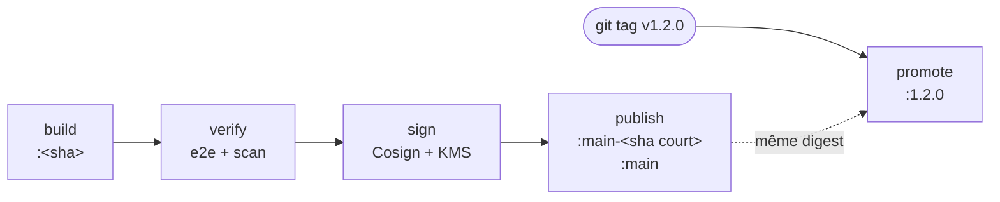

# Intégration continue

[](../en/CI.md) [](CI.md)

Votely est construit et testé par GitLab CI à chaque merge request et à chaque commit sur
`main`. Pipelines : https://gitlab.com/StateOfFlowHunter/votely/-/pipelines

## Organisation

```
.gitlab-ci.yml                  # point d'entrée : workflow, stages, valeurs par défaut, includes
.gitlab/ci/
├── templates.gitlab-ci.yml     # briques communes (build Docker, règles)
├── backend.gitlab-ci.yml       # jobs backend:*
├── frontend.gitlab-ci.yml      # jobs frontend:*
├── e2e.gitlab-ci.yml           # jobs e2e:*
├── security.gitlab-ci.yml      # jobs security:*
├── deploy.gitlab-ci.yml        # jobs deploy:* (charts Helm)
├── infra.gitlab-ci.yml         # jobs infra:* (Terraform)
└── environments.gitlab-ci.yml  # jobs staging:* et prod:* (déploiement GitOps)
```

- Un fichier par composant : tout ce qui concerne le pipeline du backend est au même endroit,
  et les stages sont déclarés une seule fois dans `.gitlab-ci.yml`.
- Le suffixe `.gitlab-ci.yml` permet aux éditeurs et aux outils GitLab de reconnaître et valider
  les fichiers.
- Les jobs sont nommés `<composant>:<action>-<outil>` (`backend:lint-ruff`, `frontend:test-vitest`) :
  le graphe du pipeline se lit d'un coup d'œil.
- Chaque fichier commence par un job caché (`.backend`, `.frontend`, `.e2e`) qui porte l'image,
  le cache et les règles communs aux jobs du composant, qui l'étendent avec `extends`.

## Quand les pipelines tournent

| Événement | Pipeline | Jobs |
|---|---|---|
| Merge request | oui | uniquement les composants dont les fichiers (ou le fichier CI) ont changé |
| Push sur une branche avec une merge request ouverte | non (le pipeline de la merge request la couvre) | – |
| Push sur `main` | oui | tous les jobs |
| Tag de version `vX.Y.Z` | oui | uniquement `*:promote-image` (voir [Versions](#publication-et-versions)) |
| Autres tags | non | – |

Filtrer les jobs des merge requests selon les fichiers modifiés garde des pipelines rapides et
économise les minutes de CI ; `main` lance toujours tout, donc la branche principale est
toujours entièrement vérifiée.

Un nouveau push annule le pipeline en cours sur la même branche (jobs `interruptible`). Les jobs
ne sont relancés qu'une fois, et uniquement en cas de panne d'infrastructure, jamais pour un test
ou un lint en échec.

## Stages

```
.pre      security:secrets-gitleaks
analyze   backend:lint-ruff  frontend:lint-oxlint  frontend:format-prettier  frontend:typecheck-tsc
          e2e:format-prettier  e2e:typecheck-tsc  security:sast-semgrep  security:deps-trivy
          deploy:lint-helm  deploy:validate-kubeconform
          infra:format-terraform  infra:validate-terraform  infra:lint-tflint  infra:plan-terraform
test      backend:test-pytest  frontend:test-vitest
build     backend:build-image  frontend:build-image
verify    e2e:test-playwright  security:scan-image-trivy: [backend, frontend]
publish   backend:sign-image  frontend:sign-image  →  backend:publish-image  frontend:publish-image
          (tags de version : *:promote-image)
deploy    staging:update-git                       (tags de version : prod:verify-cosign → prod:update-git)
```

| Stage | Rôle | Job | Outil et périmètre |
|---|---|---|---|
| `.pre` | Porte d'entrée : toujours en premier | `security:secrets-gitleaks` | gitleaks : secrets dans les nouveaux commits (merge requests) ou dans tout l'historique (branche principale) |
| `analyze` | Le code source, sans l'exécuter | `backend:lint-ruff` | ruff : règles de lint et de sécurité (Bandit), ordre des imports, formatage |
| | | `frontend:lint-oxlint` | oxlint (les avertissements font échouer le job) |
| | | `frontend:format-prettier`, `e2e:format-prettier` | Prettier |
| | | `frontend:typecheck-tsc`, `e2e:typecheck-tsc` | Compilateur TypeScript, mode strict |
| | | `security:sast-semgrep` | Semgrep : règles Python, TypeScript, React, OWASP Top 10 et Dockerfile |
| | | `security:deps-trivy` | Trivy : vulnérabilités connues dans les dépendances de production (`uv.lock`, `package-lock.json`) |
| | | `deploy:lint-helm`, `deploy:validate-kubeconform` | Helm lint (strict), puis chaque manifeste généré validé contre les schémas de l'API Kubernetes et le catalogue de CRD |
| | | `infra:format-terraform`, `infra:validate-terraform`, `infra:lint-tflint` | Format, validation et tflint (règles AWS) de chaque stack Terraform |
| | | `infra:plan-terraform` | `terraform plan` en lecture seule via OpenID Connect : les relecteurs voient ce qui changerait sur AWS |
| `test` | L'exécution du code | `backend:test-pytest` | pytest : tests unitaires et d'intégration face à un service PostgreSQL 16, migrations comprises ; couverture ≥ 90 % |
| | | `frontend:test-vitest` | Vitest : composants et pages face à une fausse API (MSW) ; couverture ≥ 80 % des lignes |
| `build` | Les images de production | `backend:build-image`, `frontend:build-image` | Docker BuildKit, poussées dans le registry de conteneurs GitLab |
| `verify` | Les images tout juste construites | `e2e:test-playwright` | Playwright, bureau et mobile, face à toute la stack lancée avec ces images |
| | | `security:scan-image-trivy` | Trivy : vulnérabilités et secrets dans chaque image, et son SBOM |
| `publish` | Signées, puis taguées | `backend:sign-image`, `frontend:sign-image` | Cosign avec une clé AWS KMS : signature et attestation signée du SBOM (branche principale) |
| | | `backend:publish-image`, `frontend:publish-image` | crane : `main` et `main-<sha court>` sur les images vérifiées et signées (branche principale) |
| | | `backend:promote-image`, `frontend:promote-image` | crane : tag de version sur l'image vérifiée sur `main` (tags de version uniquement) |
| `deploy` | Versions des environnements écrites dans Git | `staging:update-git` | Commite `main-<sha court>` dans les valeurs de staging (branche principale) ; Argo CD le déploie |
| | | `prod:verify-cosign`, `prod:update-git` | Vérifie les signatures des images de la version, puis commite la version dans les valeurs de production (tags de version uniquement) |

Les jobs sont nommés `<composant>:<action>-<outil>` : ce que fait le job et avec quel outil,
regroupés par composant dans le graphe.

Chaque job de test n'attend que les vérifications de son propre composant (`needs`) : une
vérification frontend lente ne retarde jamais les tests du backend.

`backend:test-pytest` tourne avec `CI=true` (toujours défini par GitLab) : si PostgreSQL était
injoignable, les tests d'intégration échoueraient au lieu d'être ignorés comme en local.

## Contrôles de sécurité

Les contrôles qui n'ont besoin que du code source passent en premier ; l'analyse des images (une
fois construites) vient dans le stage `verify`.

| Job | Ce qu'il trouve | Échoue quand |
|---|---|---|
| `security:secrets-gitleaks` | Mots de passe, tokens et clés commités dans Git | un secret est trouvé |
| `security:sast-semgrep` | Motifs de code vulnérables dans notre code (injection, en-têtes dangereux, crypto faible…) | une alerte est trouvée |
| `backend:lint-ruff` (règles `S`) | Appels risqués propres à Python (`eval`, `subprocess` avec un shell, mots de passe en dur…) | une alerte en dehors de `tests/` |
| `security:deps-trivy` | CVE connues dans les dépendances de production | une vulnérabilité HIGH ou CRITICAL **pour laquelle un correctif existe** |
| `security:scan-image-trivy` | CVE connues dans tout ce que contiennent les images (paquets du système de base compris), secrets restés dans une couche | une vulnérabilité HIGH ou CRITICAL corrigeable, ou un secret |

- Seules les vulnérabilités de dépendances corrigeables font échouer le pipeline : ce sont celles
  sur lesquelles on peut agir (mise à jour) ; les autres sont listées dans l'artefact
  `trivy-deps.json`. Les dépendances de développement (Vite, Vitest, Playwright) ne font pas
  partie des images et ne sont pas analysées.
- Chaque alerte est aussi écrite au format **JUnit** : elle apparaît comme un test en échec dans
  l'onglet *Tests* du pipeline et dans le widget de la merge request. Les widgets de sécurité
  natifs de GitLab demandent l'offre Ultimate ; les rapports complets (SARIF, JSON) sont gardés
  en artefacts.
- La première exécution de Semgrep a montré que nginx transmettait à l'API l'en-tête `Host` du
  client (une valeur contrôlée par l'attaquant) ; il n'est plus transmis.

### Analyse des images et SBOM

`security:scan-image-trivy` tourne une fois par image (`parallel: matrix`), en même temps que les
tests end-to-end, sur le digest exporté par le job de build : l'image analysée est celle qui
sera déployée.

- **Pourquoi analyser aussi les images** : les fichiers de verrouillage ne listent que nos
  dépendances. L'image de base apporte ses propres paquets (Debian ou Alpine, OpenSSL, zlib…), et
  un fichier copié par erreur peut contenir un secret. Les deux n'existent que dans l'image.
- **Sans démon Docker** : Trivy lit les couches directement dans le registry, authentifié avec le
  jeton du job.
- **SBOM** (*Software Bill of Materials*, nomenclature logicielle) : l'analyse liste aussi chaque
  paquet de l'image, enregistré en artefact au format CycloneDX (`sbom-<composant>.cdx.json`).
  Quand une nouvelle CVE est publiée, le SBOM indique quelles images contiennent le paquet
  concerné, sans les reconstruire ni les réanalyser. Il est ensuite signé et attaché à l'image
  (voir [Images signées](#images-signées)).
- **Vérifié** : une ancienne image `nginx:1.20-alpine` fait échouer le job (30 vulnérabilités
  HIGH/CRITICAL corrigeables), tout comme une image contenant un token GitHub écrit dans une
  couche (affiché masqué).

### Défense en profondeur pour les secrets

Un pipeline démarre **après** le push : à ce moment, un secret qui a fuité est déjà public (et
copié par le miroir). Le job de CI limite les dégâts, il ne peut pas empêcher la fuite. Plusieurs
couches sont donc combinées :

| Couche | Quand | Comment |
|---|---|---|
| 1. Prévention | Avant le commit | Hook pre-commit gitleaks (`uvx pre-commit install`) |
| 2. Protection au push | Le push est refusé | Push protection de GitHub sur le miroir ; secret push protection de GitLab (Ultimate) |
| 3. Détection | Après le push | `security:secrets-gitleaks`, qui arrête le pipeline : rien n'est construit ni déployé |
| 4. Réponse | Dès la détection | **Révoquer et renouveler le secret.** Réécrire l'historique Git ne suffit pas : les dépôts publics sont scannés en quelques minutes |

## Images de conteneurs

Les images sont poussées dans le registry de conteneurs du projet :
`registry.gitlab.com/stateofflowhunter/votely/<composant>:<SHA du commit>`.

- **Tags immuables** : le SHA complet du commit identifie exactement ce qui a été construit. Les
  tags de déploiement (`main`, versions) ne sont ajoutés qu'une fois le stage `verify` passé
  (voir plus bas).
- **Jamais sans tests** : chaque job de build dépend (`needs`) des tests de son composant ; un
  test en échec empêche la publication de l'image.
- **Les deux images, ou aucune** : les builds tournent dès qu'un chemin applicatif change
  (`.rules:app`), pour que les tests end-to-end utilisent toujours un backend et un frontend du
  même commit. Reconstruire une image inchangée est rapide grâce au cache des couches.
- **Cache des couches dans le registry** (`:buildcache`, BuildKit `mode=max`) : écrit uniquement
  par la branche principale, lu par tous les pipelines.
- **Traçabilité** : des labels OCI enregistrent le dépôt source, le commit et la date de build.
- **Digest transmis aux jobs suivants** : chaque build exporte `BACKEND_IMAGE` /
  `FRONTEND_IMAGE` (`…@sha256:…`) en artefact dotenv ; les jobs suivants utilisent exactement
  l'image construite, pas un tag qui pourrait bouger.

Les builds utilisent Docker-in-Docker avec BuildKit (`docker buildx`), la configuration standard
sur les runners partagés de GitLab.com.

## Publication et versions

Les images sont **construites une fois, puis promues** : une version ne reconstruit rien, elle
donne un numéro à une image déjà vérifiée sur `main`.



| Tag | Ajouté par | Désigne |
|---|---|---|
| `<sha du commit>` | `*:build-image`, chaque pipeline | un build, vérifié ou non (merge requests comprises) |
| `main-<sha court>` | `*:publish-image`, branche principale | l'image de ce commit, **vérifiée** par tout le pipeline |
| `main` | `*:publish-image`, branche principale | la dernière image vérifiée (staging) |
| `1.2.0` | `*:promote-image`, tag de version `v1.2.0` | le même digest que `main-<sha court>` (production) |

- **Ce qui tourne en production est ce qui a été testé**, octet pour octet : même digest que
  l'image passée par les tests end-to-end, les analyses et le staging. Reconstruire tirerait des
  images de base et des paquets plus récents, et produirait une autre image, non testée.
- `main-<sha court>` n'est ajouté qu'après `verify` : son existence prouve que l'image a été
  vérifiée. Le job de promotion le cherche : taguer un commit absent de `main`, ou dont le
  pipeline a échoué, fait échouer le pipeline de version avec un message explicite.
- Les tags sont ajoutés dans le registry avec [crane](https://github.com/google/go-containerregistry/tree/main/cmd/crane) :
  sans démon Docker, sans rien télécharger, quelques secondes par image.
- Les pipelines de version ne lancent rien d'autre : le commit a déjà été vérifié sur `main`.

### Images signées

Sur `main`, chaque image est signée avant de recevoir un tag de déploiement : une image non
signée n'est jamais promue.

| Étape | Ce que fait `*:sign-image` |
|---|---|
| Signer | `cosign sign` sur le digest, avec la clé `awskms:///alias/votely-cosign` : la clé privée ne quitte jamais AWS KMS, le job demande seulement à KMS de signer |
| Attester | `cosign attest --type cyclonedx` : le SBOM issu de l'analyse de l'image, signé et attaché à l'image |
| Vérifier | `cosign verify` et `cosign verify-attestation` avec la clé publique commitée dans le dépôt ([`cosign.pub`](../../cosign.pub)), exactement comme le ferait n'importe qui |

- Le job accède à KMS avec des identifiants AWS temporaires obtenus via OpenID Connect ; seuls
  les pipelines de la branche principale peuvent utiliser le rôle de signature (voir
  [INFRA.md](INFRA.md#accès-de-la-ci-openid-connect)).
- Comme pour le registry privé d'une entreprise, rien n'est envoyé au journal de transparence
  public de Sigstore (Rekor) : signatures et attestations sont rangées dans le registry du
  projet, à côté de l'image (tags `sha256-…`, conservés par la politique de nettoyage).
- N'importe qui peut vérifier une image :

  ```bash
  cosign verify --key cosign.pub --insecure-ignore-tlog \
    registry.gitlab.com/stateofflowhunter/votely/backend:main
  cosign verify-attestation --key cosign.pub --insecure-ignore-tlog --type cyclonedx \
    registry.gitlab.com/stateofflowhunter/votely/backend:main
  ```

  `--insecure-ignore-tlog` indique seulement à Cosign de ne pas chercher la signature dans le
  journal public, où elle n'a volontairement pas été publiée. Les images publiées avant la mise
  en place de la signature (`0.1.0`) n'ont pas de signature.

Pour publier une version, taguer le commit de merge qui tourne en staging, une fois son pipeline
`main` passé (pas un commit `chore(deploy)` de la CI : ils ne lancent aucun pipeline, ils n'ont
donc pas d'images) :

```bash
git tag -a v1.2.0 <commit de merge> -m "v1.2.0"
git push origin v1.2.0
```

Le pipeline de version promeut les images, vérifie leurs signatures et commite la version dans les
valeurs de production ; Argo CD la déploie ([GITOPS.md](GITOPS.md)).

La politique de nettoyage du registry conserve les tags de version, `main`, le cache de build et
les signatures (`sha256-…`) ;
les images de commits plus anciennes sont supprimées après 14 jours : un commit doit donc être
publié en version dans ce délai.

## Tests end-to-end

`e2e:test-playwright` lance la même stack jetable que sur un poste de développement (`compose.yaml` +
`compose.e2e.yaml`), dans Docker-in-Docker, avec **les images exactes construites par le
pipeline** : les digests des jobs de build (`BACKEND_IMAGE`, `FRONTEND_IMAGE`) sont passés à
Compose via `VOTELY_BACKEND_IMAGE` et `VOTELY_FRONTEND_IMAGE`. Ce qui est testé est, octet pour
octet, ce qui sera déployé.

- Les identifiants de base sont des valeurs jetables de CI ; la clé de signature JWT est
  aléatoire à chaque exécution.
- Playwright tourne dans l'image officielle (`mcr.microsoft.com/playwright`), branchée sur le
  réseau de la stack, et joint nginx sur `http://frontend:8080`.
- Le démon dind ne partage pas le système de fichiers du job : les tests y sont copiés et les
  rapports récupérés avec `docker cp`.
- Artefacts, conservés une semaine même en cas d'échec : le rapport HTML, les traces / vidéos /
  captures des tests échoués, et les logs de chaque conteneur de la stack.

## Rapports

| Rapport | Où il apparaît |
|---|---|
| JUnit (backend, frontend, e2e et jobs de sécurité) | Onglet *Tests* du pipeline, et widget de la merge request (nouveaux échecs, tests corrigés) |
| Pourcentage de couverture | Widget de la merge request et liste des jobs, extrait du log du job |
| Cobertura (`coverage.xml`) | Lignes couvertes et non couvertes surlignées dans le diff de la merge request |

Les rapports sont envoyés même quand les tests échouent (`when: always`) et conservés une semaine.

## Cache

Les dépendances sont mises en cache par composant, avec le fichier de verrouillage comme clé
(`uv.lock`, `package-lock.json`) : le cache est réutilisé tant que les dépendances ne changent
pas. Les fichiers de verrouillage sont toujours respectés (`UV_FROZEN`, `npm ci`) : la CI
n'installe jamais autre chose que ce qui a été relu.

## Images

| Composant | Image CI |
|---|---|
| Backend | `ghcr.io/astral-sh/uv:0.12-python3.12-trixie-slim` (même Python et même Debian que l'image de production) |
| Frontend, e2e | `node:24-alpine` |
