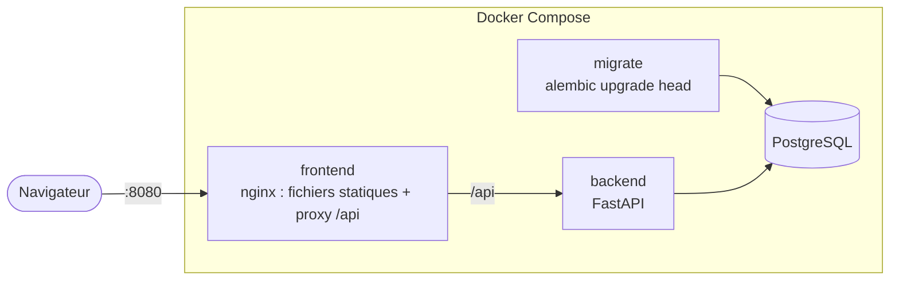

# Conteneurs

[](../en/CONTAINERS.md) [](CONTAINERS.md)

Votely est livré sous forme de deux images, construites avec des Dockerfiles multi-étapes, et
tourne en local comme une stack complète avec Docker Compose.

| Image | Base | Taille compressée | Utilisateur |
|---|---|---|---|
| `votely-backend` | `python:3.12-slim` | ~76 Mo | uid `10001` |
| `votely-frontend` | `nginxinc/nginx-unprivileged:1.30-alpine` | ~26 Mo | uid `101` |

## Lancer toute la stack

```bash
cp .env.example .env     # définir un mot de passe de base et un secret JWT (openssl rand -hex 32)
docker compose up --build
```

Ouvrir http://localhost:8080. Seul le frontend est publié, sur `127.0.0.1`.



| Service | Rôle | Démarre quand |
|---|---|---|
| `db` | PostgreSQL 16, données dans le volume `db-data` | – |
| `migrate` | Tâche ponctuelle : `alembic upgrade head`, puis s'arrête | `db` est en bonne santé |
| `backend` | API, non publiée sur la machine | `migrate` s'est terminé avec succès |
| `frontend` | nginx sur le port 8080 | `backend` est en bonne santé |

Lancer les migrations dans une tâche séparée, avant le démarrage de l'API, évite que plusieurs
réplicas de l'API tentent de migrer le schéma en même temps. Le même principe deviendra un Job
Kubernetes plus tard.

`docker compose up -d db` démarre toujours la base seule, pour le développement local sans
conteneur pour l'application (voir le [README](../../README.fr.md)).

## Image du backend

- **Étape de build** : `uv sync --frozen --no-dev` installe exactement les dépendances
  verrouillées dans un virtualenv. Les dépendances sont installées avant de copier le code :
  cette couche reste en cache tant que `uv.lock` ne change pas.
- **Étape finale** : seuls le virtualenv, `app/` et les migrations sont copiés. Ni uv, ni
  compilateur, ni tests.
- Les mises à jour de sécurité Debian sont appliquées par-dessus l'image de base
  (`apt-get upgrade`) : les correctifs publiés après la construction de l'image de base
  n'attendent pas sa prochaine reconstruction.
- Les dépendances d'exécution restent légères : `fastapi` + `uvicorn[standard]` au lieu de
  `fastapi[standard]`, qui embarque aussi des outils CLI et cloud (virtualenv réduit de 40 %).
- Le `HEALTHCHECK` appelle `/healthz` avec Python (les images slim n'ont pas curl).
- Uvicorn fait confiance aux en-têtes `X-Forwarded-*`, car l'API tourne toujours derrière un
  reverse proxy.

## Image du frontend

- **Étape de build** : `npm ci` puis `npm run build` avec Node.js 24.
- **Étape finale** : les fichiers statiques servis par nginx, avec un utilisateur non-root sur
  le port 8080.
- La configuration nginx (`frontend/nginx/`) est un modèle : `VOTELY_API_UPSTREAM` est injecté
  au démarrage, donc **la même image** fonctionne dans tous les environnements.

| Chemin | Comportement |
|---|---|
| `/api/` | Reverse proxy vers le backend (même origine pour le navigateur). Le nom d'hôte est re-résolu toutes les 10 s : un backend redémarré avec une nouvelle IP est retrouvé ; un backend injoignable échoue vite avec `502` (connexion limitée à 5 s) |
| `/assets/` | Fichiers avec empreinte, en cache un an (`immutable`), gzip |
| `/healthz` | Liveness du conteneur |
| tout le reste | `index.html` (routes côté client), `no-cache` pour prendre en compte les déploiements |

En-têtes de sécurité envoyés sur chaque réponse :

| En-tête | Effet |
|---|---|
| `Content-Security-Policy` | Uniquement des ressources de la même origine ; pas de script inline, pas d'intégration en iframe |
| `X-Content-Type-Options: nosniff` | Le navigateur ne devine pas le type des fichiers |
| `Referrer-Policy: strict-origin-when-cross-origin` | Les URL complètes ne fuient pas vers d'autres sites |
| `Permissions-Policy` | Caméra, micro et géolocalisation désactivés |

`server_tokens off` masque la version de nginx.

## Durcissement

Appliqué aux conteneurs applicatifs dans `compose.yaml` :

| Mesure | Effet |
|---|---|
| Utilisateurs non-root | Un processus compromis n'a pas les droits root dans le conteneur |
| `read_only: true` | Rien ne peut être écrit en dehors des montages `tmpfs` explicites |
| `cap_drop: [ALL]` | Aucune capacité Linux |
| `no-new-privileges` | Pas d'élévation de privilèges via des binaires setuid |
| Ports liés à `127.0.0.1` | Rien n'est accessible depuis le réseau local |
| Contextes de build minimaux (`.dockerignore`) | `.env`, caches et tests n'arrivent jamais dans les images |

## Vérifications

```bash
# Vulnérabilités pour lesquelles un correctif existe
docker run --rm -v /var/run/docker.sock:/var/run/docker.sock aquasec/trivy \
  image --severity HIGH,CRITICAL --ignore-unfixed votely-backend:local

# Secrets embarqués par erreur dans une image
docker run --rm -v /var/run/docker.sock:/var/run/docker.sock aquasec/trivy \
  image --scanners secret votely-frontend:local
```

Les deux images ne présentent actuellement aucune vulnérabilité HIGH/CRITICAL corrigeable et
aucun secret.

## Configuration

| Variable | Utilisée par | Défaut |
|---|---|---|
| `POSTGRES_USER`, `POSTGRES_PASSWORD`, `POSTGRES_DB` | `db`, URL du backend | – (obligatoire) |
| `VOTELY_JWT_SECRET` | backend | – (obligatoire) |
| `VOTELY_COOKIE_SECURE` | backend | `true` (`false` dans `.env` pour le HTTP simple en local) |
| `VOTELY_LOG_LEVEL` | backend | `INFO` |
| `VOTELY_HTTP_PORT` | port publié du frontend | `8080` |
| `VOTELY_API_UPSTREAM` | nginx du frontend | `http://backend:8000` |
| `VOTELY_BACKEND_IMAGE`, `VOTELY_FRONTEND_IMAGE` | Compose | `votely-backend:local`, `votely-frontend:local` (la CI utilise les images du registry) |
