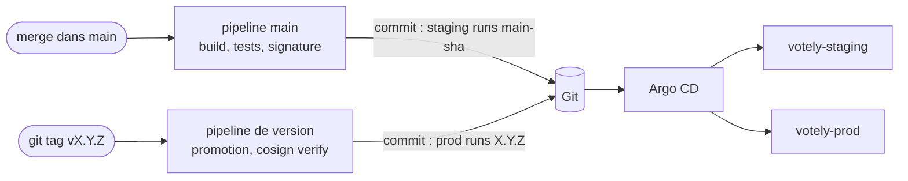

# GitOps (Argo CD)

[](../en/GITOPS.md) [](GITOPS.md)

Le cluster fait tourner ce que décrit la branche principale. [Argo CD](https://argo-cd.readthedocs.io/),
installé dans le cluster, compare en continu Git et le cluster, et applique les différences. Le
pipeline ne touche jamais au cluster : pour déployer, il commite une version dans Git.



## Organisation

```
deploy/
├── argocd/
│   ├── root.yaml                  # l'application racine, appliquée une seule fois
│   └── apps/                      # toutes les applications du cluster
├── environments/
│   ├── staging/                   # values.yaml (version, nom d'hôte) + sealed-secrets.yaml
│   └── prod/
├── platform/
│   ├── argocd/values.yaml         # réglages d'Argo CD
│   ├── cert-manager/              # émetteurs Let's Encrypt
│   └── sealed-secrets/            # certificat public de chiffrement
└── helm/                          # charts postgres et votely
```

**App of apps :** l'application racine surveille `deploy/argocd/apps/` sur `main`. Ajouter un
fichier dans ce dossier déploie une nouvelle application ; le retirer la supprime. Les vagues de
synchronisation déploient la plateforme en premier.

| Application | Contenu | Vague |
|---|---|---|
| `cert-manager` | chart cert-manager (certificats HTTPS) | -2 |
| `sealed-secrets` | contrôleur Sealed Secrets | -2 |
| `cluster-issuers` | émetteurs Let's Encrypt de test et de production | -1 |
| `staging-database`, `prod-database` | PostgreSQL et les identifiants chiffrés de l'environnement | 0 |
| `staging-votely`, `prod-votely` | chart Votely avec les valeurs de l'environnement | 0 |

Chaque application se synchronise automatiquement, supprime ce que Git ne décrit plus et
**se répare d'elle-même** : une modification faite à la main dans le cluster est ramenée à ce que
dit Git.

## Environnements

| | Staging | Production |
|---|---|---|
| Namespace | `votely-staging` | `votely-prod` |
| URL | https://staging.votely.52.16.15.223.sslip.io | https://votely.52.16.15.223.sslip.io |
| Version | chaque merge dans `main` | les tags de version uniquement |
| Copies | 1 | 2 |

Chaque environnement a sa propre base, ses propres identifiants et son propre certificat.

## Déployer

| Vers | Comment | Ce qui se passe |
|---|---|---|
| **Staging** | Fusionner une merge request | `staging:update-git` commite `main-<sha court>` dans `deploy/environments/staging/values.yaml` une fois les images signées |
| **Production** | `git tag -a vX.Y.Z <commit de merge>` puis pousser le tag | `prod:verify-cosign` vérifie les signatures, `prod:update-git` commite `X.Y.Z` dans `deploy/environments/prod/values.yaml` |

Taguer le commit de merge qui tourne en staging : les commits `chore(deploy)` de la CI ne lancent
aucun pipeline et n'ont pas d'images.

Chaque déploiement est un commit de **Votely CI**, `chore(deploy): <env> runs <version> [skip ci]` :
l'historique dit ce qui a tourné où et quand. `[skip ci]` empêche un changement de version de
relancer un pipeline. La CI écrit avec `GITOPS_TOKEN`, un jeton d'accès au projet limité à
`write_repository`, stocké dans une variable masquée, cachée et protégée : seuls la branche
principale et les tags de version protégés (`v*`) le reçoivent, jamais une merge request.

Argo CD consulte Git toutes les trois minutes : un déploiement démarre quelques minutes après le
commit.

## Revenir en arrière

```bash
git revert <le commit chore(deploy)>
git push origin main
```

Le revert garde `[skip ci]` : rien n'est reconstruit, les images précédentes sont toujours dans le
registry. Argo CD déploie la version précédente avec une mise à jour progressive (les nouveaux pods
sont prêts avant l'arrêt des anciens). Testé en production, dans les deux sens, en moins de trois
minutes chaque fois :

```
eea82df  Reapply "chore(deploy): prod runs 0.3.0 [skip ci]"   # retour en 0.3.0
63bb139  Revert "chore(deploy): prod runs 0.3.0 [skip ci]"    # retour arrière en 0.2.0
```

Les migrations de la base ne sont pas annulées : une migration doit rester compatible avec la
version précédente de l'application (ajouter avant de retirer), pour que revenir en arrière sur le
code soit toujours sûr.

## Secrets

Les identifiants sont générés et chiffrés par [`deploy/aws/seal-secrets.sh`](../../deploy/aws/seal-secrets.sh)
avec le certificat public du contrôleur ; seul le contrôleur, dans le cluster, peut les déchiffrer.
Un secret chiffré est lié à son namespace et à son nom.

- **Changer** un identifiant : supprimer `deploy/environments/<env>/sealed-secrets.yaml`, relancer
  le script et fusionner. Les pods lisent leur environnement au démarrage : les redémarrer
  (`kubectl rollout restart deployment -n votely-<env>`). PostgreSQL n'utilise son mot de passe
  qu'à la toute première création de ses données : un nouveau mot de passe doit aussi être appliqué
  dans la base (`ALTER USER`).
- **La clé privée du contrôleur** vit dans le cluster, sur le disque de données permanent. Une copie
  gardée hors de Git permet à un nouveau cluster de lire les mêmes secrets chiffrés :

  ```bash
  kubectl -n kube-system get secret -l sealedsecrets.bitnami.com/sealed-secrets-key -o yaml \
    > sealed-secrets-key.yaml   # à ranger hors ligne, jamais dans Git
  ```

  Sans elle, un nouveau cluster reçoit une nouvelle clé : récupérer le nouveau certificat et
  chiffrer à nouveau les identifiants.

## Accès à Argo CD

L'interface web n'est pas exposée sur Internet. Via le tunnel Systems Manager :

```bash
deploy/aws/tunnel.sh        # terminal 1
deploy/aws/argocd-ui.sh     # terminal 2 : affiche le mot de passe admin initial, ouvre http://localhost:8080
```

## Un nouveau cluster

1. `terraform apply` dans `infra/terraform/server` (voir [INFRA.md](INFRA.md)).
2. `deploy/aws/fetch-kubeconfig.sh`, puis `deploy/aws/tunnel.sh`.
3. `deploy/aws/install-argocd.sh` : Argo CD, puis l'application racine. Tout le reste vient de Git.

Avec le disque de données permanent, un serveur remplacé garde tout le cluster, Argo CD compris :
aucune de ces étapes n'est à refaire.
