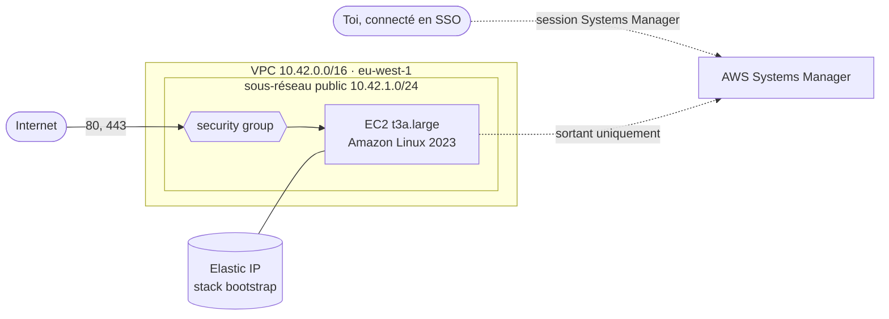

# Infrastructure (AWS)

[](../en/INFRA.md) [](INFRA.md)

Votely tourne sur AWS, en **eu-west-1 (Irlande)**. Tout est décrit avec Terraform dans
`infra/terraform/` ; rien n'est créé ni modifié à la main dans la console, qui ne sert qu'à
regarder.

```
infra/terraform/
├── .tflint.hcl     # règles de lint communes à toutes les stacks (Terraform + AWS)
├── bootstrap/      # conservé : bucket du state, alerte budget, IP publique, accès CI, clé de signature
└── server/         # créé et détruit à volonté : réseau, pare-feu, serveur
```



Chaque dossier est une **stack** séparée, avec son propre state et son propre cycle de vie : le
bootstrap est créé une fois et conservé, le serveur est créé et détruit à volonté.

## Accès à AWS

| Qui | Comment | Secret permanent |
|---|---|---|
| Une personne | IAM Identity Center : portail d'accès avec mot de passe + MFA, identifiants temporaires pour la CLI | aucun |
| L'utilisateur root | Uniquement pour les rares tâches de compte qui l'exigent ; protégé par MFA | – |
| GitLab CI | OpenID Connect : un jeton signé par GitLab pour chaque job, échangé contre un rôle temporaire | aucun |

La CLI utilise un profil SSO (`~/.aws/config`, en dehors du dépôt) :

```ini
[sso-session votely]
sso_start_url = https://<id-du-portail>.awsapps.com/start
sso_region = eu-west-1
sso_registration_scopes = sso:account:access

[profile votely]
sso_session = votely
sso_account_id = <id du compte>
sso_role_name = AdministratorAccess
region = eu-west-1
```

```bash
aws sso login --profile votely      # ouvre le navigateur : mot de passe + MFA, valable 8 heures
export AWS_PROFILE=votely
aws sts get-caller-identity         # qui suis-je ? (lecture seule)
```

Aucune clé d'accès n'est jamais créée : les identifiants expirent d'eux-mêmes et rien sur le
disque ne peut fuiter. L'identifiant du compte n'est pas écrit dans le dépôt non plus.

## Bootstrap : state Terraform et budget

Terraform tient un registre de ce qu'il gère, le **state**, et le compare au code pour savoir
quoi créer, modifier ou supprimer. Le state contient le détail des ressources et parfois des
secrets : il ne va jamais dans Git, il est rangé dans un bucket S3 dédié.

| Réglage | Pourquoi |
|---|---|
| Versioning | Chaque modification garde la version précédente : un mauvais apply peut être annulé |
| Chiffrement (SSE-S3) | Données chiffrées au repos |
| Accès public bloqué, propriété imposée | Le bucket n'est accessible que via IAM |
| HTTPS uniquement (politique du bucket) | Aucune requête non chiffrée acceptée |
| Anciennes versions supprimées après 90 jours | Un historique, sans croissance infinie |
| `prevent_destroy` | Terraform refuse de supprimer le bucket |
| `use_lockfile` | Verrou natif S3 : deux `apply` ne peuvent jamais tourner en même temps (plus besoin de table DynamoDB) |

Le nom du bucket a un suffixe aléatoire (`votely-tfstate-08da0d86`) : les noms de bucket sont
uniques au monde, et l'identifiant du compte reste en dehors du dépôt.

L'**alerte budget** (`votely-monthly`, 10 USD par mois) envoie un email à 80 % et à 100 % des
coûts réels, et dès qu'AWS prévoit un dépassement sur le mois. L'adresse vient de
`terraform.tfvars`, ignoré par Git (`terraform.tfvars.example` montre le format).

### Premier lancement : le state déménage dans son propre bucket

Le bootstrap range son state dans le bucket qu'il crée : le bucket doit donc exister d'abord.

```bash
cd infra/terraform/bootstrap
cp terraform.tfvars.example terraform.tfvars   # puis renseigner budget_email

# 1. Créer le bucket avec un state local (backend_override.tf est ignoré par Git)
printf 'terraform {\n  backend "local" {}\n}\n' > backend_override.tf
terraform init
terraform plan -out=bootstrap.tfplan
terraform apply bootstrap.tfplan

# 2. Déménager le state dans le bucket
rm backend_override.tf
terraform init -migrate-state                  # répondre "yes"
rm terraform.tfstate bootstrap.tfplan          # les copies locales ne servent plus
terraform plan                                 # "No changes" : code, state et AWS correspondent
```

`terraform plan -out` enregistre le plan relu, et `terraform apply <fichier>` applique exactement
ce plan : si quelque chose a changé entre-temps, Terraform refuse le plan périmé au lieu de faire
autre chose.

## Serveur

La stack `server` regroupe tout ce qui ne coûte que lorsqu'il tourne. Elle est créée au début
d'une session de travail et détruite à la fin ; l'adresse IP permanente reste dans la stack
bootstrap : l'adresse publique (et plus tard le nom d'hôte et son certificat HTTPS) ne change
jamais.

| Ressource | Réglages |
|---|---|
| VPC et sous-réseau public | `10.42.0.0/16`, un sous-réseau, une internet gateway. **Pas de NAT gateway** : elle coûterait plus cher que le serveur, qui a sa propre adresse publique |
| Security group par défaut | Vidé : rien ne peut l'utiliser par accident |
| Security group | Entrée **80 et 443 uniquement** ; sortie libre (images, paquets, Let's Encrypt, Systems Manager) |
| Rôle IAM | `AmazonSSMManagedInstanceCore` uniquement : le serveur peut s'enregistrer auprès de Systems Manager, rien d'autre |
| Instance EC2 | `t3a.large` (2 vCPU, 8 Gio), dernière Amazon Linux 2023, disque gp3 chiffré de 30 Gio |
| Métadonnées de l'instance | IMDSv2 obligatoire, un seul saut réseau : les conteneurs ne peuvent pas lire les identifiants de l'instance |
| Elastic IP | Créée par la stack bootstrap (`prevent_destroy`), associée par la stack server, retrouvée par son tag `Name` |

**Pas de SSH.** Le port 22 est fermé et aucune paire de clés n'existe. Un terminal s'ouvre via
AWS Systems Manager, avec la même connexion SSO que la console ; chaque session est tracée dans
l'historique de Session Manager. C'est le serveur qui se connecte à Systems Manager : aucun port
entrant n'est nécessaire.

```bash
cd infra/terraform/server
terraform init
terraform plan -out=server.tfplan
terraform apply server.tfplan       # ~2 minutes, affiche instance_id, public_ip et shell

aws ssm start-session --target <instance_id>   # nécessite le plugin Session Manager
nc -zv -w 5 <public_ip> 22                     # expire : SSH est bloqué

terraform destroy                   # fin de session : le serveur ne coûte plus rien
```

Le plugin Session Manager est un simple binaire publié par AWS ; sous Linux, on peut l'extraire
du `.deb` officiel (`session-manager-plugin.deb`) dans `~/.local/bin`.

Une image Amazon Linux plus récente est prise à chaque recréation du serveur ; un serveur en
marche n'est jamais remplacé parce qu'une nouvelle image est sortie (`ignore_changes = [ami]`).

## Accès de la CI (OpenID Connect)

La CI GitLab a besoin d'AWS pour deux choses : un `terraform plan` en lecture seule dans les
merge requests, et la signature des images. Aucune clé AWS n'est stockée dans GitLab :

1. GitLab signe un jeton de courte durée pour le job (`id_tokens`), qui indique pour quel projet
   et quelle branche il tourne (`project_path:StateOfFlowHunter/votely:ref_type:branch:ref:<branche>`).
2. AWS vérifie la signature auprès du fournisseur OpenID Connect de GitLab déclaré dans la stack
   bootstrap, et le sujet auprès de la politique de confiance du rôle.
3. AWS renvoie des identifiants valables une heure ; les SDK AWS les lisent via `AWS_ROLE_ARN` et
   `AWS_WEB_IDENTITY_TOKEN_FILE`.

| Rôle | Qui peut l'utiliser | Droits |
|---|---|---|
| `votely-ci-plan` | Toute branche du projet (merge requests) | `ReadOnlyAccess` : voir, jamais modifier |
| `votely-ci-signer` | La branche principale uniquement | `kms:Sign` et `kms:GetPublicKey` sur la clé Cosign, rien d'autre |

- **Les forks ne peuvent pas les utiliser** : les pipelines d'un fork portent le chemin du fork
  dans leur jeton. Le réglage qui ferait tourner les merge requests de forks dans le projet
  parent reste désactivé.
- **Les apply restent manuels** : aucun rôle de CI ne peut créer, modifier ou supprimer quoi que
  ce soit ; les changements sont relus dans le plan de la merge request, puis appliqués par une
  personne.
- **Le plan est public mais discret** : l'identifiant du compte et l'email du budget sont des
  variables CI/CD masquées (`AWS_ACCOUNT_ID`, `TF_VAR_budget_email`), affichées `[MASKED]` dans
  les logs, et aucun fichier de plan n'est gardé en artefact (il contiendrait des valeurs
  sensibles en clair). Le plan tourne sans verrou du state, qui demanderait un accès en écriture.

## Clé de signature des images

`alias/votely-cosign` est une clé AWS KMS asymétrique (ECDSA P-256, `SIGN_VERIFY`) utilisée par
Cosign dans la CI ([CI.md](CI.md#images-signées)). La clé privée ne peut pas être exportée ; la clé
publique est commitée dans [`cosign.pub`](../../cosign.pub) :

```bash
cosign public-key --key awskms:///alias/votely-cosign > cosign.pub
```

La clé est protégée par `prevent_destroy` et un délai de suppression de 30 jours : la supprimer
par erreur rendrait invérifiables toutes les signatures existantes.

## Vérifications

```bash
cd infra/terraform
terraform fmt -recursive -check
terraform -chdir=bootstrap validate
terraform -chdir=server validate
tflint --init --config="$PWD/.tflint.hcl"
tflint --chdir=bootstrap --config="$PWD/.tflint.hcl"
tflint --chdir=server --config="$PWD/.tflint.hcl"
```

Les versions des providers sont verrouillées dans `.terraform.lock.hcl` pour Linux et macOS : chaque
machine et la CI utilisent les mêmes builds.

## Coûts

| Ressource | Coût |
|---|---|
| Bucket du state (quelques Ko) | quelques centimes par an |
| Alerte budget | gratuite (les deux premiers budgets d'un compte sont gratuits) |
| Elastic IP, conservée entre les sessions | ~0,005 USD de l'heure, ~3,60 USD par mois |
| Serveur (`t3a.large` + disque de 30 Gio) quand il tourne | ~0,09 USD de l'heure, ~0,70 USD pour une session de 8 heures |
| Clé de signature (KMS) | 1 USD par mois, plus quelques centimes pour 10 000 signatures |
| Rôles de CI et fournisseur OpenID Connect | gratuits |

Le serveur ne tourne que pendant les sessions de travail : `terraform destroy` dans `server/`
arrête son coût, et l'alerte budget signale tout oubli.
