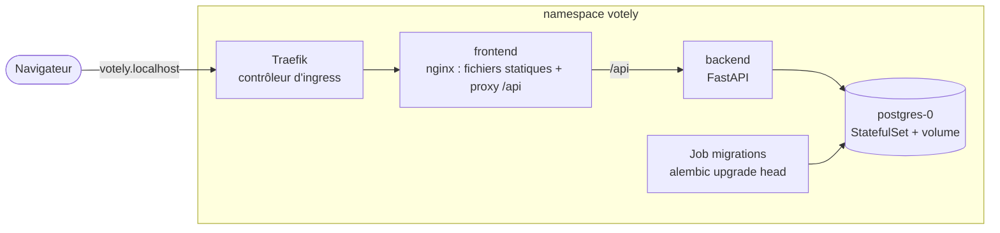

# Kubernetes

[](../en/KUBERNETES.md) [](KUBERNETES.md)

Votely est empaqueté pour Kubernetes sous forme de deux charts Helm, dans `deploy/helm/`. Les
mêmes charts tournent sur un cluster local ([kind](https://kind.sigs.k8s.io/)) et sur le serveur
k3s ; seules leurs valeurs changent.



## Vocabulaire

| Objet | Rôle dans Votely |
|---|---|
| Pod | Un conteneur en marche (une instance de l'API, une instance de nginx…) |
| Deployment | Maintient le nombre voulu de pods identiques, les remplace un par un lors d'une mise à jour (backend, frontend) |
| StatefulSet | Pareil, pour un pod qui possède des données : nom stable et volume dédié (PostgreSQL) |
| Service | Adresse interne stable devant des pods (`votely-backend:8000`) |
| Ingress | Routage HTTP depuis l'extérieur du cluster : `votely.localhost` → frontend |
| Job | Une tâche qui s'exécute jusqu'au bout (migrations de la base) |
| Secret | Identifiants, injectés dans les pods en variables d'environnement |
| Chart / release Helm | Un paquet de manifestes paramétrés / une installation de ce paquet, avec ses valeurs |

## Le lancer en local

Prérequis : Docker et [mise](https://mise.jdx.dev/) (`mise install` fixe les versions de kind,
kubectl et Helm).

```bash
deploy/kind/up.sh                    # cluster + Traefik + PostgreSQL + Votely, puis http://votely.localhost
VOTELY_TAG=0.1.0 deploy/kind/up.sh   # une version publiée au lieu du dernier build de `main`
deploy/kind/down.sh                  # supprimer le cluster et ses données
```

`up.sh` est idempotent : le relancer met à jour. Il déploie les images publiées par la CI
(`main` par défaut) : ce qui tourne en local est ce qui a passé le pipeline.

La suite end-to-end tourne contre le cluster comme contre n'importe quel environnement :

```bash
cd e2e && E2E_BASE_URL=http://votely.localhost npm test
```

Commandes utiles :

```bash
kubectl -n votely get pods                     # ce qui tourne
kubectl -n votely logs deploy/votely-backend   # logs de l'API
helm -n votely history votely                  # releases et leurs révisions
helm -n votely rollback votely 1               # revenir à la révision 1
```

## Deux charts

| Chart | Contenu |
|---|---|
| `postgres` | StatefulSet, Service headless, volume (PersistentVolumeClaim) |
| `votely` | backend et frontend (un Deployment + un Service chacun), Ingress, Job de migrations |

La base n'a pas le même cycle de vie que l'application : l'application est mise à jour, remise
en arrière ou réinstallée de nombreuses fois, les données doivent survivre à tout cela. Avec
des charts séparés, rien de ce qui est fait à la release `votely` ne peut supprimer la base ni
son volume.

## Migrations de la base

Le Job de migrations lance `alembic upgrade head` comme **hook Helm pre-install / pre-upgrade** :
Helm attend qu'il réussisse avant de créer ou de mettre à jour les pods de l'API ; le nouveau
code ne tourne donc jamais sur un ancien schéma. S'il échoue, la release s'arrête là et la
version en place continue de servir.

- C'est la version Kubernetes du service `migrate` de Docker Compose : une migration par
  release, jamais une par réplica de l'API.
- ArgoCD exécute ces hooks Helm comme des hooks *PreSync* : le comportement reste le même en
  GitOps.
- Le Job est supprimé une fois réussi ; un Job en échec est gardé pour ses logs, jusqu'à la
  release suivante.
- Les nouvelles tentatives (`backoffLimit`) couvrent une base encore en cours de démarrage.

## Configuration et secrets

| Valeur | Défaut | Rôle |
|---|---|---|
| `image.tag` | `main` | Version des images : `main` ou une version publiée (`0.1.0`) |
| `host` | `votely.localhost` | Nom d'hôte routé par l'ingress |
| `cookieSecure` | `true` | Cookie de session uniquement en HTTPS (`false` sur le cluster local) |
| `backend.replicas`, `frontend.replicas` | `2` | Pods par composant (`1` en local) |
| `database.existingSecret` | `votely-db` | Secret avec `username`, `password`, `database` |
| `jwt.existingSecret` | `votely-jwt` | Secret avec `jwt-secret` |

`values-kind.yaml` contient les réglages du cluster local ; staging et production auront leurs
propres fichiers.

- **Aucun secret dans les charts ni dans Git.** Les charts ne font que référencer des Secrets
  par leur nom. En local, `up.sh` génère des identifiants aléatoires directement dans le
  cluster ; sur le serveur, Sealed Secrets fournit les mêmes Secrets à partir de fichiers
  chiffrés.
- L'URL de la base est assemblée par Kubernetes à partir des clés du Secret (références
  `$(DB_PASSWORD)`) : le mot de passe n'apparaît dans aucun manifeste.

## Réglages de sécurité

Chaque pod tourne avec les réglages du Pod Security Standard *restricted* :

| Réglage | Effet |
|---|---|
| `runAsNonRoot` (uid 10001 backend, 101 nginx, 70 postgres) | Refusé par Kubernetes si l'image tournait en root |
| `readOnlyRootFilesystem` | Rien ne peut être écrit en dehors des volumes `emptyDir` explicites (`/tmp`, configuration nginx) |
| `capabilities: drop [ALL]`, `allowPrivilegeEscalation: false` | Aucune capacité Linux, pas d'élévation via setuid |
| `seccompProfile: RuntimeDefault` | Appels système dangereux bloqués |
| `automountServiceAccountToken: false` | Les pods ne reçoivent aucun identifiant pour l'API Kubernetes : ils n'en ont jamais besoin |

## Santé et ressources

- La **liveness** (`/healthz`) ne touche jamais la base : une panne de la base ne doit pas
  faire redémarrer des pods de l'API en bonne santé.
- La **readiness** (`/readyz`) vérifie la base : un pod qui ne peut pas servir ne reçoit pas de
  trafic.
- Chaque conteneur a des réservations CPU et mémoire (placement) et une limite mémoire (une
  fuite ne peut pas faire tomber le nœud).

## Trouvé pendant le déploiement

- **Limite mémoire trop basse.** La suite end-to-end lancée contre le cluster a fait tuer le
  pod de l'API (`OOMKilled`) à 256 Mio : le hachage des mots de passe (Argon2) utilise environ
  64 Mio par connexion ou inscription en cours, et les tests tournent en parallèle. La limite du
  backend est maintenant de 512 Mio.
- **Noms de service courts dans nginx.** nginx résout lui-même le nom du backend et ignore les
  domaines de recherche du cluster : le proxy utilise donc le nom complet
  (`votely-backend.<namespace>.svc.cluster.local`).

## Intégration continue

À chaque merge request qui touche `deploy/` (voir [CI.md](CI.md)) :

- `deploy:lint-helm` : `helm lint --strict` sur les deux charts, puis génération de chaque chart
  avec chacun de ses fichiers de valeurs ;
- `deploy:validate-kubeconform` : valide chaque manifeste généré contre les schémas de l'API
  Kubernetes de la version du cluster. Un champ mal orthographié (`runAsNonRot`) fait échouer
  le pipeline plutôt que le déploiement.
