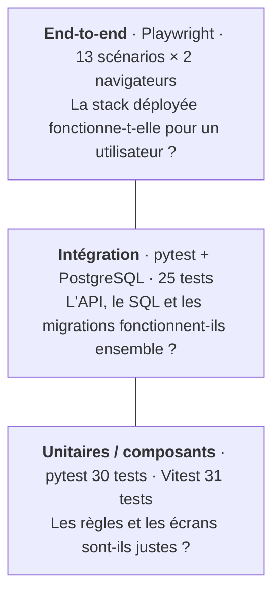

# Tests

[](../en/TESTS.md) [](TESTS.md)

Votely est testé à trois niveaux. Chaque niveau répond à une question différente, et la plupart
des tests se trouvent au niveau le plus rapide capable d'y répondre.



| Niveau | Outil | Contre quoi | Durée | Détails |
|---|---|---|---|---|
| Backend unitaire | pytest | faux en mémoire, horloge fixe | < 1 s | [BACK.md](BACK.md#tests) |
| Backend intégration | pytest | vrai PostgreSQL, vraies migrations | ~5 s | [BACK.md](BACK.md#tests) |
| Frontend | Vitest, Testing Library, MSW | toute l'application dans jsdom, fausse API HTTP | ~2 s | [FRONT.md](FRONT.md#tests) |
| End-to-end | Playwright | toute la stack Docker Compose dans Chromium | ~10 s | ci-dessous |

## Tests end-to-end

Le projet `e2e/` pilote un vrai navigateur face à toute la stack Docker Compose : nginx, l'API,
les migrations et PostgreSQL, exactement tels qu'ils sont livrés.

Les tests tournent sur une **stack jetable** (`compose.e2e.yaml` appliqué par-dessus
`compose.yaml`) : son propre projet Compose (`votely-e2e`), son propre port (8081) et une base en
mémoire. Les données de développement ne sont jamais touchées, la stack de développement peut
continuer à tourner sur 8080, et `stack:down` supprime tout.

### Les lancer

```bash
cd e2e
npm ci
npx playwright install chromium  # une fois : télécharge le navigateur utilisé par les tests

npm run stack:up                 # stack jetable sur http://localhost:8081
npm test                         # sans fenêtre, bureau + mobile
npm run stack:down               # supprime les conteneurs et les données
```

`E2E_BASE_URL` permet de viser un autre environnement (par exemple staging).

En CI, le job `e2e:test` lance la même suite face aux images construites par le pipeline (voir
[CI.md](CI.md#tests-end-to-end)).

### Les regarder

| Commande | Ce qu'on obtient |
|---|---|
| `npm run test:ui` | Interface Playwright : choisir les tests, les regarder tourner, parcourir une frise avec l'état du DOM, le réseau et la console à chaque action |
| `npm run test:headed` | Une fenêtre Chromium visible, un test à la fois, 1,5 s entre chaque action. Plus lent ou plus rapide : `SLOW_MO=3000 npm run test:headed` (en millisecondes) |
| `npm run test:debug` | Pas à pas : le Playwright Inspector s'arrête avant chaque action et surligne l'élément visé ; *Step over* exécute la suivante |
| `npm run report` | Rapport HTML du dernier lancement, avec captures, vidéos et traces des tests échoués |
| `npx playwright show-trace <trace.zip>` | Rejouer un test échoué étape par étape |

Ajouter `-g "<partie du nom du test>"` à n'importe laquelle pour lancer un seul test, par exemple
`npm run test:headed -- -g "creates a poll"`.

Traces, vidéos et captures ne sont gardées que pour les tests échoués : le rapport reste léger.

### Scénarios

Chaque scénario tourne deux fois : Chrome **bureau** et **mobile** (émulation Pixel 7).

| Fichier | Scénario |
|---|---|
| `auth.spec.ts` | Inscription (le cookie de session est `HttpOnly` + `SameSite=Lax`), connexion par le formulaire, identifiants incorrects, déconnexion |
| `polls.spec.ts` | Créer un sondage, voter et voir les résultats · un second vote est impossible dans l'interface et refusé par l'API (`409`) · les résultats se mettent à jour en direct quand un autre utilisateur vote · un visiteur anonyme peut consulter mais doit se connecter pour voter · la connexion ramène à la création de sondage |
| `platform.spec.ts` | Endpoints de santé · en-têtes de sécurité (CSP, `nosniff`, version de nginx masquée) · accès direct aux routes côté client · aucune erreur dans la console |

### Règles d'écriture

- **Tests indépendants** : chaque test crée ses propres utilisateurs et sondages avec des noms
  uniques ; les tests tournent en parallèle, dans n'importe quel ordre, sur n'importe quelle
  base.
- **Préparer par l'API, vérifier par l'interface** : quand la connexion n'est pas le sujet du
  test, il s'inscrit et se connecte avec `page.request` (mêmes cookies que la page), ce qui est
  rapide et stable ; les écrans testés sont toujours utilisés comme le ferait un utilisateur.
- **Sélecteurs accessibles** : les éléments sont trouvés par rôle et libellé
  (`getByRole('button', { name: 'Vote' })`), jamais par classe CSS. Un test qui ne trouve pas un
  élément révèle souvent un problème d'accessibilité.
- **Assertions qui attendent** : `expect(locator).toBeVisible()` attend que la condition soit
  vraie ; aucun `sleep` fixe nulle part.
- **Plusieurs utilisateurs** : un second contexte de navigateur donne une session indépendante,
  utilisée pour tester les résultats en direct et les droits.
- **Données de test lisibles** : les sondages viennent d'une petite collection de questions
  légères en français (`SAMPLE_POLLS` dans `tests/fixtures.ts`) ; un lancement des tests fait
  aussi une bonne démo.

### Fiabilité

- La suite a été lancée 5 fois d'affilée (130 exécutions) sans un seul échec.
- En CI, un test échoué est relancé une fois ; un test qui passe à la relance est signalé comme
  *flaky* (instable).
- `forbidOnly` fait échouer la CI si un `test.only` est commité par erreur.

### Bugs trouvés

Arrêter le backend pendant les tests e2e a montré que nginx attendait 30 secondes avant
d'échouer, et ne résolvait l'adresse du backend qu'une seule fois, au démarrage. Le proxy
re-résout maintenant l'adresse toutes les 10 secondes et échoue en moins de 5 secondes avec une
`502` (voir [CONTAINERS.md](CONTAINERS.md)).

## Tous les tests d'un coup

```bash
docker compose up -d db       # PostgreSQL pour les tests d'intégration du backend
(cd backend && uv run pytest)
(cd frontend && npm test)
(cd e2e && npm run stack:up && npm test; npm run stack:down)
```
